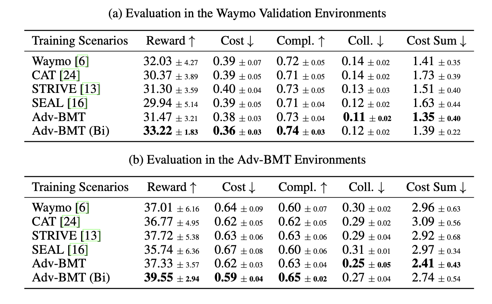

<style>
.video-container {
  position: relative;
  max-width: 80%; /* Adjust this value to control the maximum width of the video container */
  margin: 0px auto 0; /* Optional: center the video container horizontally */
}

.video-container video {
  display: block;
  margin: 0 auto;
  max-width: 100%;
  max-height: 100%;
}
</style>


## Safety-critical Augmentations
<div class="video-container">
  <video loop autoplay muted playsinline src="../assets/img/Adv-BMT/demo_1.mp4"></video>
</div>

<!--research-section-splitter-->


## TL; DR
:fire: **Adv-BMT** augments `diverse` and `realistic` collision interactions from real-world driving logs.

:star2: **Adv-BMT** generates collision interactions through adversarial initializations + reverse motion predictions.

:blue_car: **Adv-BMT** can be leveraged as a closed-loop generator for reinforcement adversarial learnings.

<!--research-section-splitter-->


## Adv-BMT Overview

<div class="img-container" style="width: 100%; margin: 0 auto;">
    
</div>

Adv-BMT takes a real-world driving log, and samples adversarial initializations. ....

<!--research-section-splitter-->


## BMT Architecture

<div class="img-container" style="width: 100%; margin: 0 auto;">
    
</div>
Out BMT model is a transformer-based model, which conducts both forward and reverse motion simulations for vehicles, bicycles, and pedestrain agents.  
<!--research-section-splitter-->


## Diverse Adversarial Behaviors
<div class="video-container">
  <video loop autoplay muted playsinline src="../assets/img/Adv-BMT/demo_2.mp4"></video>
</div>
<!--research-section-splitter-->

## Safer Agent via Adversarial Learnings
<div class="video-container">
  <video loop autoplay muted playsinline src="../assets/img/Adv-BMT/Safer_Agent_demo.mp4"></video>
</div>
<!--research-section-splitter-->


<!-- ## Experiment
Adv-BMT scenarios improves over RL agents trained from Waymo datasets in terms of image safety and driving completions.

<div class="img-container">
    
</div>

research-section-splitter -->


## Citation
```BibTeX
Will fill out with Arxiv paper bibtex.
```


<!--research-section-splitter-->

## Prior Works

**[CAT (CoRL 2022)](https://metadriverse.github.io/cat/)**:
Closed-loop adversarial training for safe end-to-end driving.

**[MetaDrive (TPAMI 2021)](https://metadriverse.github.io/metadrive/)**:
An open-source platform for large-scale traffic scenario simulation and modeling


