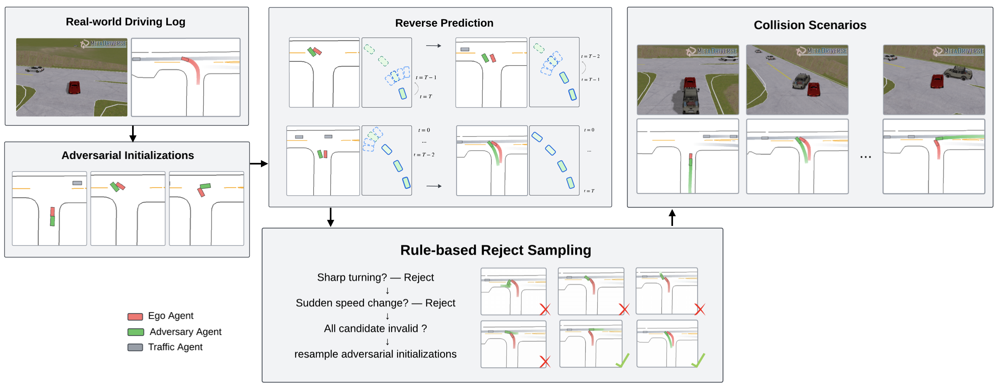
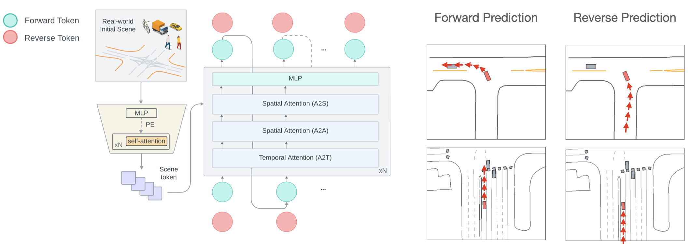
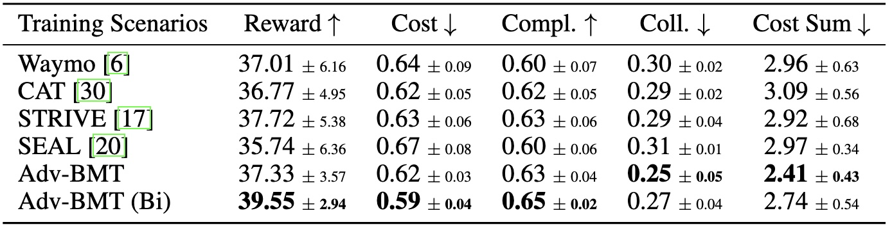

  <video loop autoplay muted playsinline src="../assets/img/Adv-BMT/demo_1_new.mp4"></video>

<!--research-section-splitter-->

## TL; DR
:blue_car: Adv-BMT for **data augmentation**: augments real-world driving logs with `realistic` and `diverse`  collision interactions.

:hammer_and_wrench: Adv-BMT is a **two-stage generation pipeline**: adversarial initialization + reverse motion prediction to produce plausible collision scenarios.

:motorway: Adv-BMT is an **adversarial scenario generator for closed-loop learning**: continuously produces diverse, realistic, collision-seeking interactions that target the ego vehicle.

<!--research-section-splitter-->

## Adv-BMT

    

Adv-BMT is a two-staged pipeline: first, it initializes diverse collision states between a new adversary agent and ego vehicle; then, it reconstructs the adversarial trajectories via BMT's reverse predictions. A rule-based rejection sampling mechanism is used to filter candidate trajectories from unsatisfactory adversarial initializations, and maintain realistic collision interactions. In the output, the new agent maintains realistic interactions with surrounding traffic.

<!--research-section-splitter-->

## BMT Architecture

    

BMT is a transformer-based motion prediction model, and is able to predict both future and history trajectories for vehicles, bicycles, and pedestrain agents.  
<!--research-section-splitter-->

## Diverse Adversarial Behaviors

  <video loop autoplay muted playsinline src="../assets/img/Adv-BMT/demo_2_1.mp4"></video>

  <video loop autoplay muted playsinline src="../assets/img/Adv-BMT/demo_2_2.mp4"></video>

<!--research-section-splitter-->

## Safer Agent via Adversarial Learnings

  <video loop autoplay muted playsinline src="../assets/img/Adv-BMT/safer_agent_demo.mp4"></video>

<!--research-section-splitter-->

## Adversarial RL Evaluations in Waymo Environments

    

## Adversarial RL Evaluated in Safety-critical Environments

    

<!--research-section-splitter-->

## Prior Works

**[CAT (CoRL 2022)](https://metadriverse.github.io/cat/)**:
Closed-loop adversarial training for safe end-to-end driving.

**[MetaDrive (TPAMI 2021)](https://metadriverse.github.io/metadrive/)**:
An open-source platform for large-scale traffic scenario simulation and modeling

