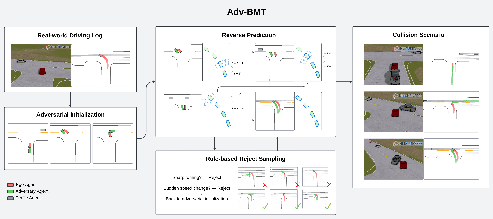
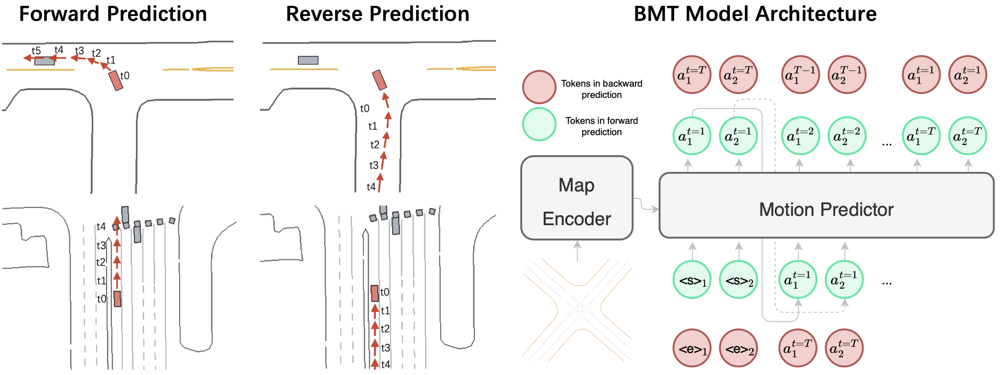
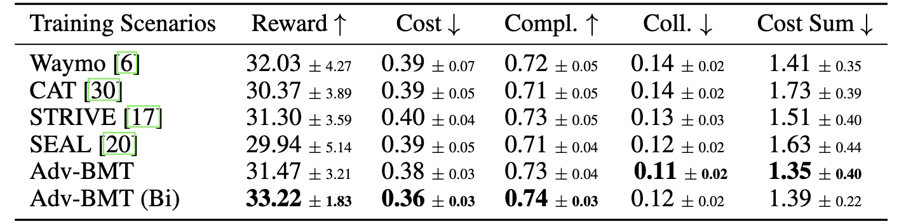

<style>
.video-container {
  position: relative;
  max-width: 100%; /* Adjust this value to control the maximum width of the video container */
  margin: 0px auto 0; /* Optional: center the video container horizontally */
}

.video-container video {
  display: block;
  margin: 0 auto;
  max-width: 100%;
  max-height: 100%;
}
</style>


<div class="video-container">
  <video loop autoplay muted playsinline src="../assets/img/Adv-BMT/demo_1_new.mp4"></video>
</div>

<!--research-section-splitter-->

## TL; DR
:blue_car: Adv-BMT augments real-world driving logs with `realistic` and `diverse`  collision interactions.

:blue_car: Adv-BMT contains three steps: (1) adversarial initialization (2) reverse motion prediction, and (3) rule-based fallbacks.

:blue_car: Adv-BMT is an **adversarial scenario generator for closed-loop learning**: continuously produces diverse accident interactions targeting at the ego vehicle.

<!--research-section-splitter-->


## Adv-BMT

<div class="img-container" style="width: 100%; margin: 0 auto;">
    
</div>

Adv-BMT first initializes diverse collision states between a new adversary agent and ego vehicle; then, it reconstructs the adversarial trajectories via BMT's reverse predictions. A rule-based fallback mechanism is used to reject candidate adversarial trajectories. In the output scene, the new adversarial agent maintains realistic interactions with surrounding traffic.  
<!--research-section-splitter-->


## BMT for Bidirectional Motion Prediction

<div class="img-container" style="width: 100%; margin: 0 auto;">
    
</div>
BMT employs two sets of motion tokens for forward and reverse predictions to generate the next-step token for each agent.
All predictions are conditioned only on the map and the one-step current state of all predicted agents.
<!--research-section-splitter-->


## Diverse Adversarial Behaviors
<div class="video-container">
  <video loop autoplay muted playsinline src="../assets/img/Adv-BMT/demo_2_1.mp4"></video>
</div>
<div class="video-container">
  <video loop autoplay muted playsinline src="../assets/img/Adv-BMT/demo_2_2.mp4"></video>
</div>
<!--research-section-splitter-->


## Real-world Rendering
<div class="video-container">
  <video loop autoplay muted playsinline src="../assets/img/Adv-BMT/dreamland_scgen_demo.mp4"></video>
</div>
We leverage Dreamland for rendering Adv-BMT scenarios into real-world accident videos.
<!--research-section-splitter-->


## Safer Agent via Adversarial Learnings
<div class="video-container" style="width: 60%; ">
  <video loop autoplay muted playsinline src="../assets/img/Adv-BMT/safer_agent_demo.mp4"></video>
</div>
<!--research-section-splitter-->

## Adversarial RL Evaluations in Waymo Environments
<div class="img-container" style="width: 60%; height: 120%; margin: 0 auto;">
    
</div>

<!--research-section-splitter-->


## Related Works
**[MetaDrive (TPAMI 2021)](https://metadriverse.github.io/metadrive/)**:
An open-source platform for large-scale traffic scenario simulation and modeling.

**[CAT (CoRL 2022)](https://metadriverse.github.io/cat/)**:
Closed-loop adversarial training for safe end-to-end driving.

**[Dreamland (Arxiv 2025)](https://metadriverse.github.io/dreamland/)**:
An open-source generative model for real-world rendered videos.

<!--research-section-splitter-->

## Reference

**Bidirectional Motion Transformer for Safety-Critical Traffic Scenario Generation (NeurIPS 2025)**:
```plain
@inproceedings{
liu2025bidirectional,
title={Bidirectional Motion Transformer for Safety-Critical Traffic Scenario Generation},
author={Yuxin Liu and Zhenghao Peng and Xuanhao Cui and Bolei Zhou},
booktitle={The Thirty-ninth Annual Conference on Neural Information Processing Systems},
year={2025},
url={https://openreview.net/forum?id=avZ01E4aYt}
}
```

<!-- **Acknowledgement**: The project was supported by NSF grants CCF-2344955 and IIS-2339769. ZP is supported by the Amazon Fellowship via UCLA Science Hub. -->


