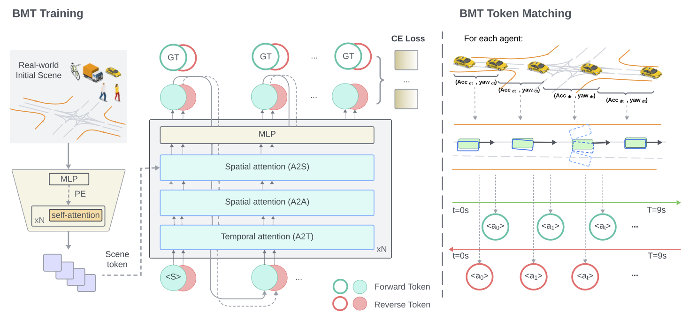

<style>
.video-container {
  position: relative;
  max-width: 80%; /* Adjust this value to control the maximum width of the video container */
  margin: 0px auto 0; /* Optional: center the video container horizontally */
}

.video-container video {
  display: block;
  margin: 0 auto;
  max-width: 100%;
  max-height: 100%;
}
</style>

## TL; DR

:star2: **Adv-BMT** augments `diverse` and `realistic` collision scenarios from real-world driving logs.

:star2: **Adv-BMT** generates collision interactions through adversarial initializations + reverse motion predictions via bidirectional motion transformer (BMT) model.

:star2: We leverage **Adv-BMT** as a closed-loop generator for reinforcement learning environments in MetaDrive Simulator.


<!--research-section-splitter-->


## BMT Architecture

<div class="img-container" style="width: 100%; margin: 0 auto;">
    
</div>

BMT has a transformer-based model architecture, with the initial real-world scene as input, and predicts the motion token sequence for either future agent motions (forward prediction) or history agent motions (reverse prediction). During token matching, BMT calculates ground-truth movements for each agent within the interval (0.5s), and match to the best candidate motion token with the minimum corner distance.

<!--research-section-splitter-->


## Safety-Critical Augmentations
<div class="video-container">
  <video loop autoplay muted playsinline src="../assets/img/Adv-BMT/safety_critical_augmentations_1.mp4"></video>
</div>

<div class="video-container">
  <video loop autoplay muted playsinline src="../assets/img/Adv-BMT/safety_critical_augmentations_2.mp4"></video>
</div>

<!--research-section-splitter-->


## Pedestrians and Bicycles Traffic Involved
<div class="video-container">
  <video loop autoplay muted playsinline src="../assets/img/Adv-BMT/pedestrians_bicycles_involved_1.mp4"></video>
</div>
<div class="video-container">
  <video loop autoplay muted playsinline src="../assets/img/Adv-BMT/pedestrians_bicycles_involved_2.mp4"></video>
</div>
<!--research-section-splitter-->


## Diverse Adversarial Behaviors
<div class="video-container">
  <video loop autoplay muted playsinline src="../assets/img/Adv-BMT/diverse_adversarial_behaviors_1.mp4"></video>
</div>
<div class="video-container">
  <video loop autoplay muted playsinline src="../assets/img/Adv-BMT/diverse_adversarial_behaviors_2.mp4"></video>
</div>

<!--research-section-splitter-->
## Used in RL trainings 
<div class="video-container">
  <video loop autoplay muted playsinline src="../assets/img/Adv-BMT/learned_safe_driving_1.mp4"></video>
</div>

<div class="video-container">
  <video loop autoplay muted playsinline src="../assets/img/Adv-BMT/learned_safe_driving_2.mp4"></video>
</div>
<!--research-section-splitter-->


## Experiment
Adv-BMT scenarios improves over RL agents trained from Waymo datasets in terms of image safety and driving completions.

<div class="img-container">
    
</div>

<!--research-section-splitter-->


## Citation
```BibTeX
Will fill out with Arxiv paper bibtex.
```


<!--research-section-splitter-->

## Prior Works

**[CAT (CoRL 2022)](https://metadriverse.github.io/cat/)**:
Closed-loop adversarial training for safe end-to-end driving.

**[MetaDrive (TPAMI 2021)](https://metadriverse.github.io/metadrive/)**:
An open-source platform for large-scale traffic scenario simulation and modeling


