## 1min Spotlight Video

*This video includes audio.*

<div id="video" style="overflow: hidden;">
  <iframe width="100%" height="100%" style="width: 101.5%; height: 101.5%; left: -0.5%; top: -0.5%;" src="https://www.youtube.com/embed/uAFp1b-SLvw?autoplay=0&loop=1&controls=1&rel=0&showinfo=0" frameborder="0" allowfullscreen="allowfullscreen"></iframe>
</div>

<!--research-section-splitter-->


## Overview

<div class="teaser">
    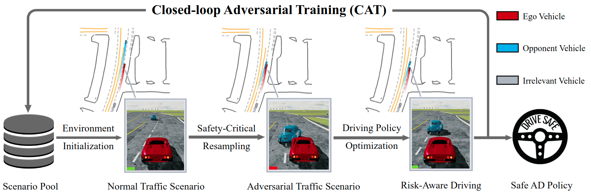
    <div class="teaser-caption">
        Fig. 1: Overview of the proposed method.
    </div>
</div>


This work introduces the Closed-loop Adversarial Training (CAT) framework for safe end-to-end driving.
CAT imports normal driving scenarios from real-world driving logs and then generates safety-critical counterparts as
adversarial training environments tailored to the current driving policy.
The agent continuously learns to address emerging challenges and improves risk awareness in a closed-loop pipeline.
After training, the agent can achieve superior driving safety in both log-replay (+32.5%) and safety-critical traffic
scenarios (+35%).


<div class="teaser">
    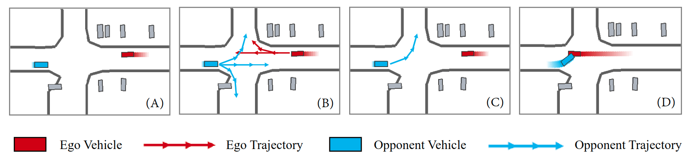
    <div class="teaser-caption">
        Fig. 2: Illustration of Factorized Safety-Critical Resampling.
    </div>
</div>


One crucial component of our framework is a novel factorized safety-critical resampling technique that
efficiently turns log-replay driving scenarios into safety-critical ones during training.

Specifically, we cast the safety-critical traffic generation as the risk-conditioned Bayesian probability maximization
problem
and then decompose it into the multiplication of standard motion forecasting sub-problems.
Thus, we can utilize off-the-shelf motion forecasting models as the learned prior to generate adversarial scenarios with
high fidelity, diversity, and efficiency.
Compared to previous adversarial traffic generation methods, the proposed technique obtains a competitive attack success
rate
while significantly reducing the computational cost (generally less than 1s), making the CAT framework effective and
efficient for closed-loop end-to-end driving policy training.


<!--research-section-splitter-->


## CAT-generated Adversarial Scenarios

Case 1: In the raw scenario, the blue car keeps going straight. After CAT generation, it turns left at the intersection.
<table class="table-bordered">
    <tr>
    <td>
        <div class="grid-teaser">
        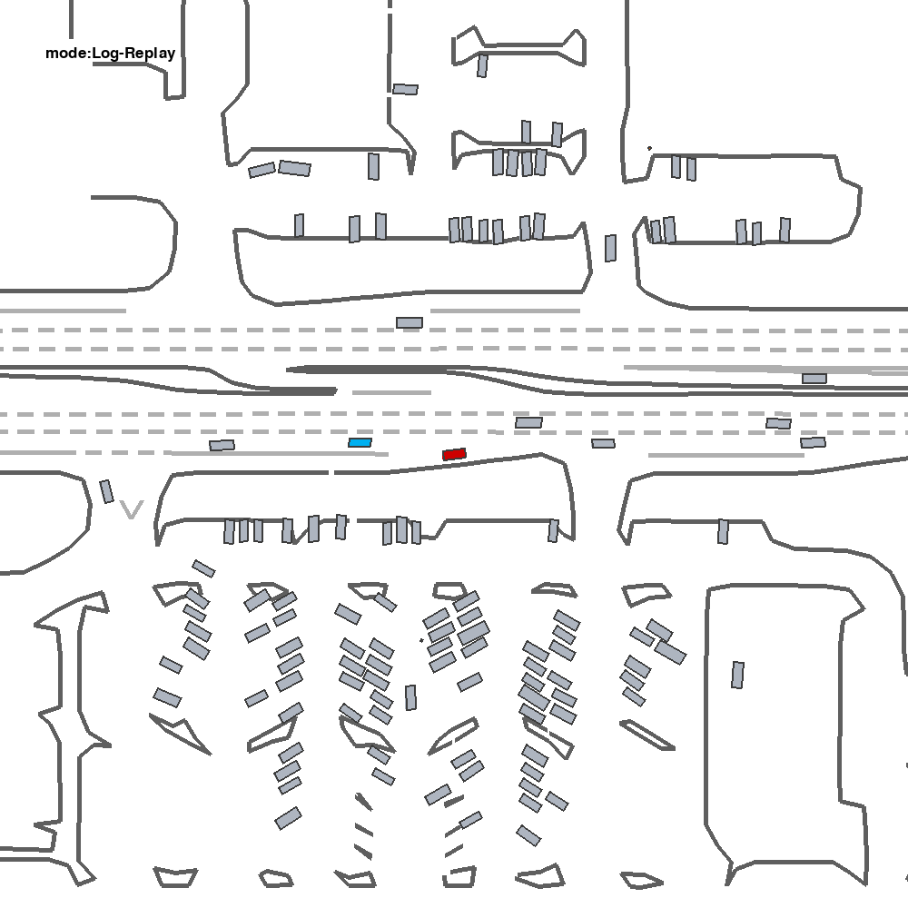
        <div class="teaser-caption">
            Raw scenario
        </div>
        </div>
    </td>
    <td>
        <div class="grid-teaser">
            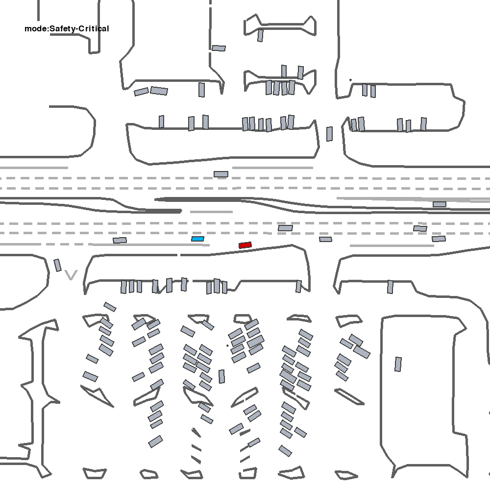
            <div class="teaser-caption">
                Generated scenario
        </div>
        </div>
    </td>
    </tr>
</table>
<br>
<br>


Case 2: In the raw scene, the blue car drives inside the roundabout. After CAT generation, it runs out of the roundabout.
<table class="table-bordered">
    <tr>
    <td>
        <div class="grid-teaser">
        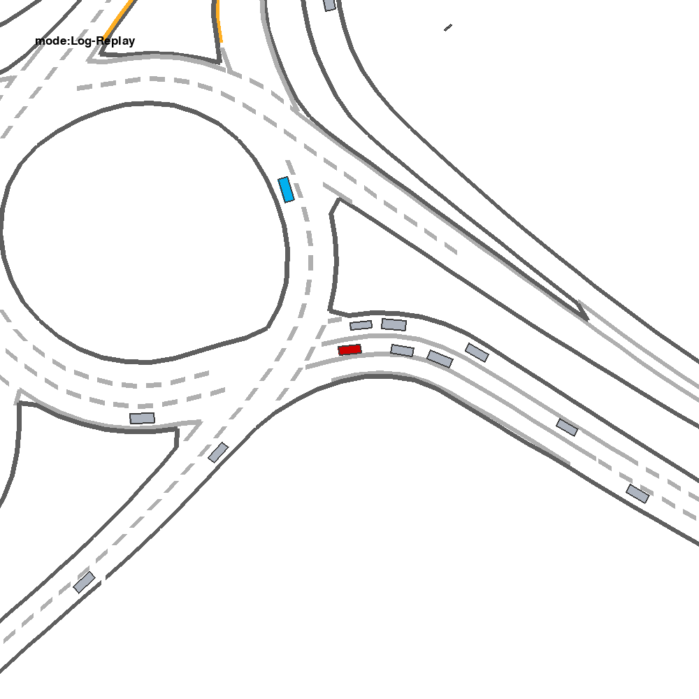
        <div class="teaser-caption">
            Raw scenario
        </div>
        </div>
    </td>
    <td>
        <div class="grid-teaser">
            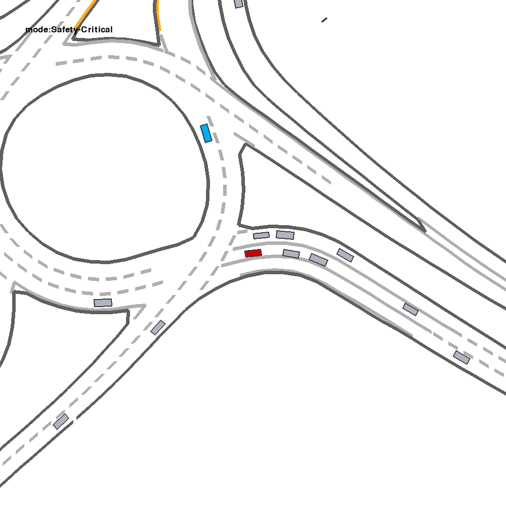
            <div class="teaser-caption">
                Generated scenario
        </div>
        </div>
    </td>
    </tr>
</table>
<br>
<br>

Case 3: In the raw scene, the blue car changes the lane gently. After CAT generation, it suddenly changes the lane.
<table class="table-bordered">
    <tr>
    <td>
        <div class="grid-teaser">
        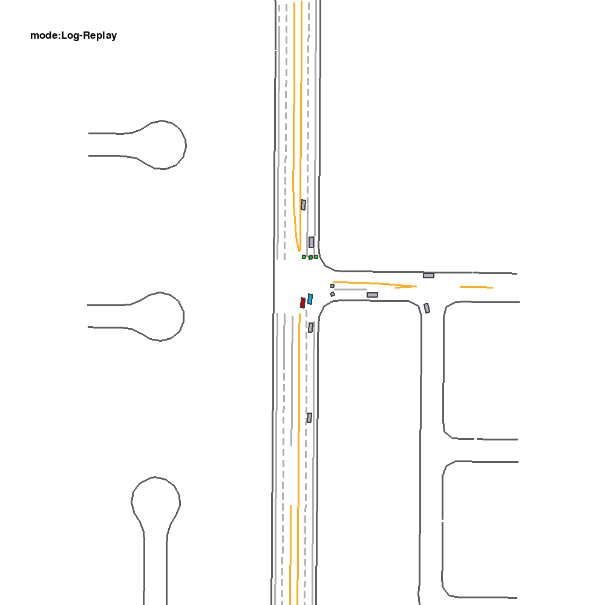
        <div class="teaser-caption">
            Raw scenario
        </div>
        </div>
    </td>
    <td>
        <div class="grid-teaser">
            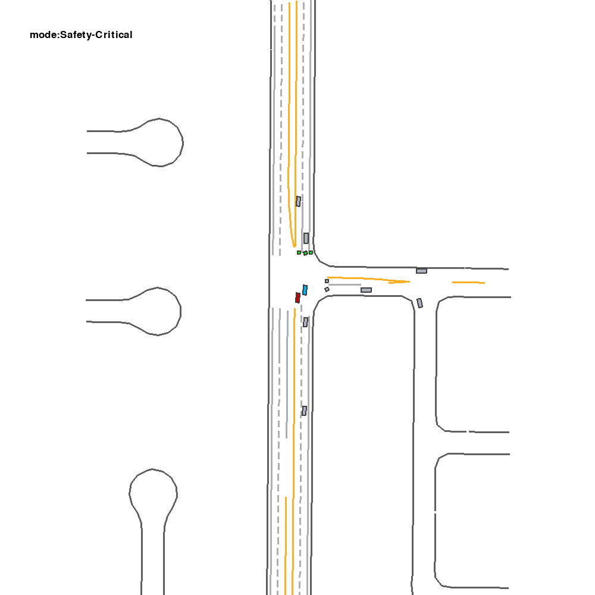
            <div class="teaser-caption">
                Generated scenario
        </div>
        </div>
    </td>
    </tr>
</table>
<br>


Case 4: In the raw scene, the blue car drive normally on the highway. After CAT generation, it brakes suddenly due to a malfunction.
<table class="table-bordered">
    <tr>
    <td>
        <div class="grid-teaser">
        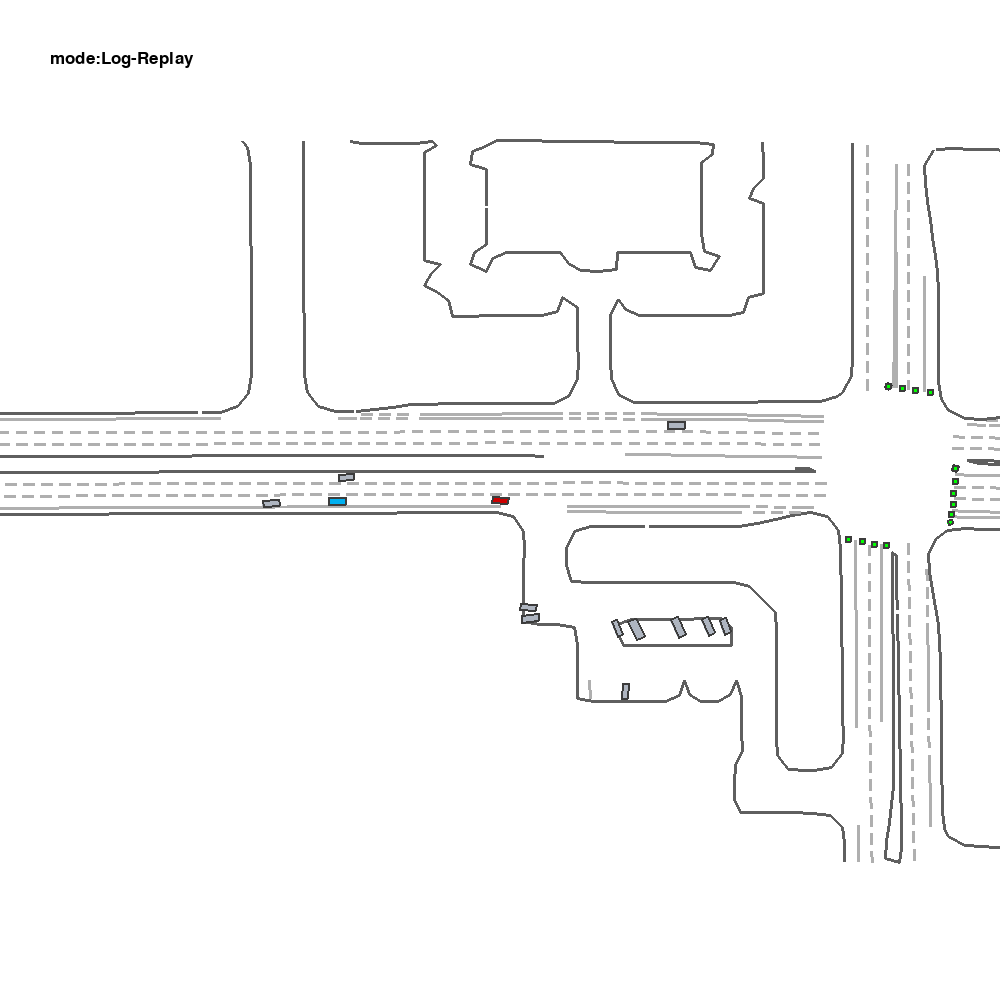
        <div class="teaser-caption">
            Raw scenario
        </div>
        </div>
    </td>
    <td>
        <div class="grid-teaser">
            
            <div class="teaser-caption">
                Generated scenario
        </div>
        </div>
    </td>
    </tr>
</table>


<!--research-section-splitter-->


## CAT Enhances AI Driving Safety

Case 1: A car makes an unprotected left turn at an intersection. The CAT agent learns to stay away from potentially dangerous vehicles.
<table class="table-bordered">
    <tr>
    <td>
        <div class="teaser">
        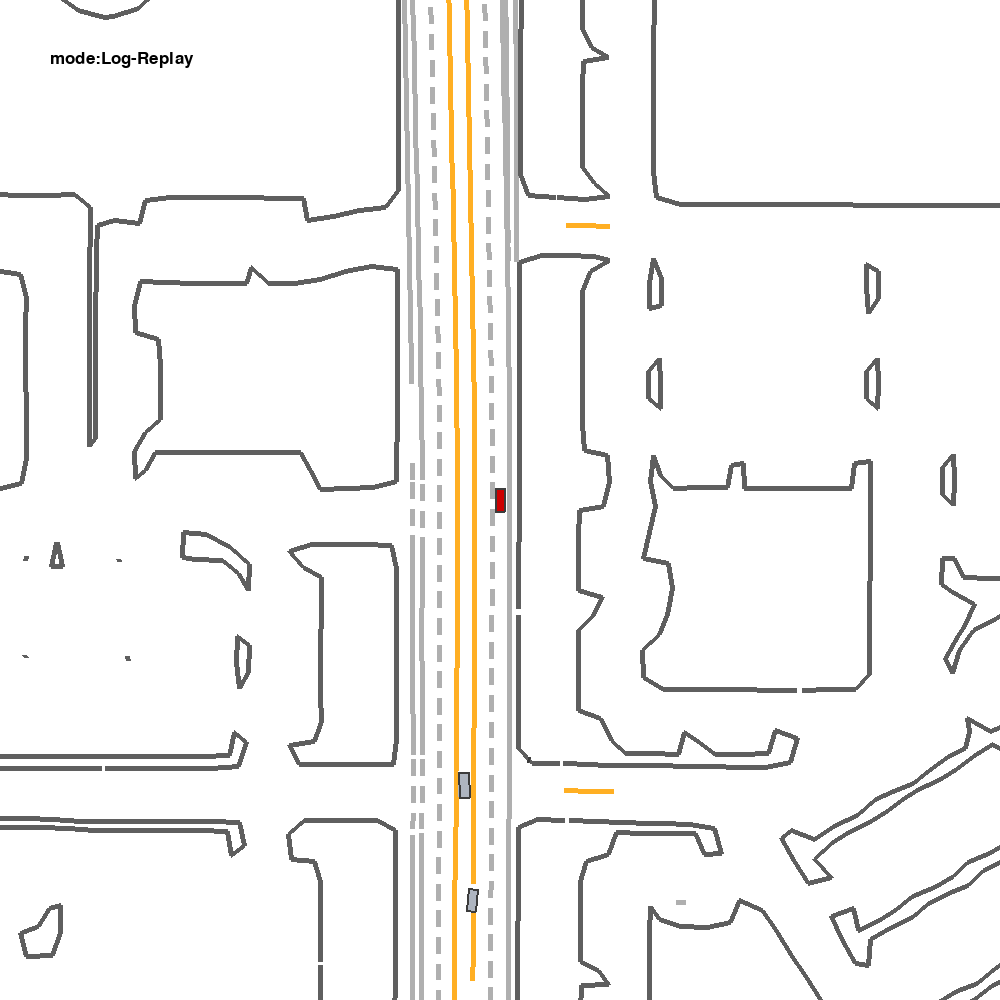
        <div class="text">
            Before CAT
        </div></div>
    </td>
    <td>
        <div class="teaser">
            
            <div class="text">
                After CAT
        </div></div>
    </td>
    </tr>
</table>
<br>


Case 2: The leading car slows down. The CAT agent learns to change its lane and overtake that vehicle.
<table class="table-bordered">
    <tr>
    <td>
        <div class="teaser">
        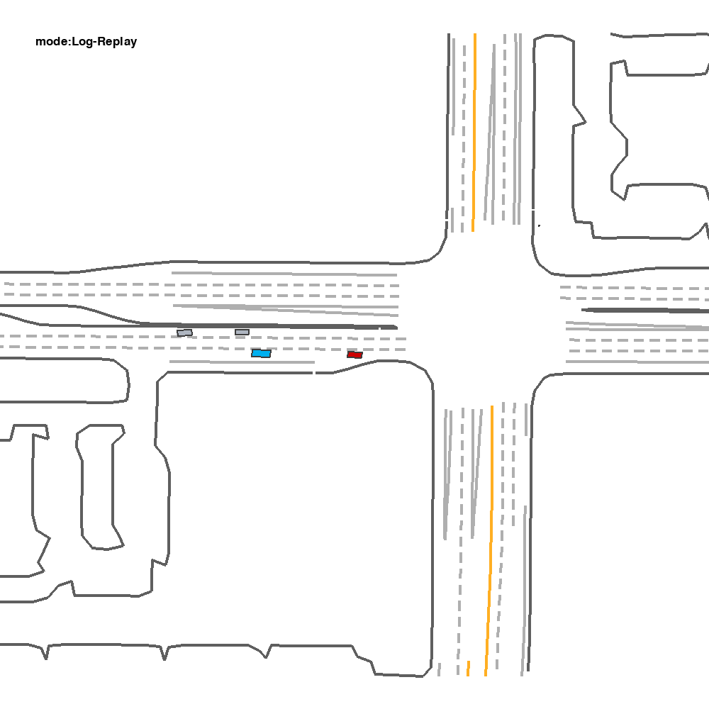
        <div class="text">
            Before CAT
        </div></div>
    </td>
    <td>
        <div class="teaser">
            
            <div class="text">
                After CAT
        </div></div>
    </td>
    </tr>
</table>
<br>

Case 3: The leading car cuts into the lane suddenly. The CAT agent learns to yield and change its lane ahead of time.
<table class="table-bordered">
    <tr>
    <td>
        <div class="teaser">
        
        <div class="text">
            Before CAT
        </div></div>
    </td>
    <td>
        <div class="teaser">
            
            <div class="text">
                After CAT
        </div></div>
    </td>
    </tr>
</table>
<br>

Case 4: Two vehicles traveling in opposite directions meet. The CAT agents learns to pass by.
<table class="table-bordered">
    <tr>
    <td>
        <div class="teaser">
        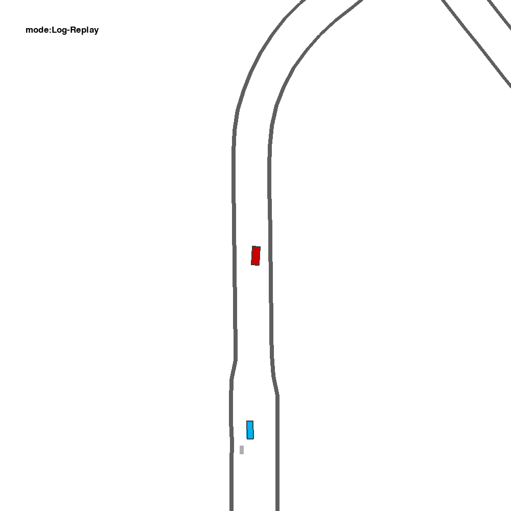
        <div class="text">
            Before CAT
        </div></div>
    </td>
    <td>
        <div class="teaser">
            
            <div class="text">
                After CAT
        </div></div>
    </td>
    </tr>
</table>


<!--research-section-splitter-->


## Reference

```plain
@inproceedings{zhang2023cat,
  title={CAT: Closed-loop Adversarial Training for Safe End-to-End Driving},
  author={Zhang, Linrui and Peng, Zhenghao and Li, Quanyi and Zhou, Bolei},
  booktitle={7th Annual Conference on Robot Learning},
  year={2023}
}
```

<br>

## Acknowledgement

This work was supported by the National Science Foundation under Grant No. 2235012 and the Cisco Faculty Award.