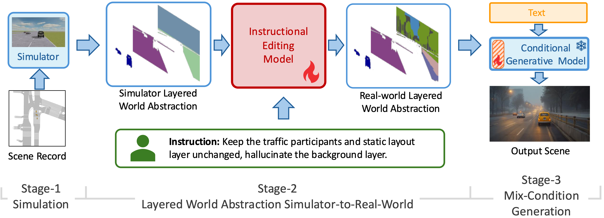
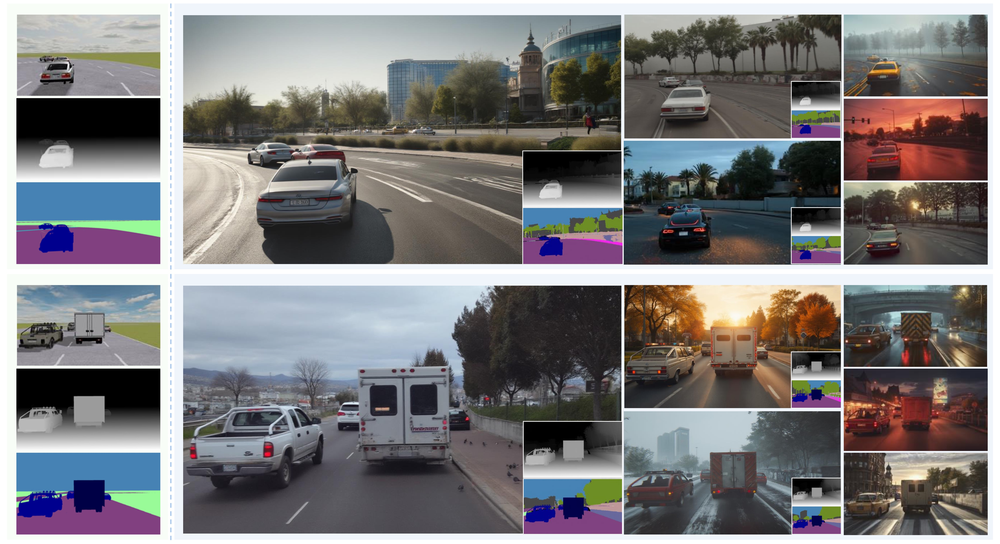
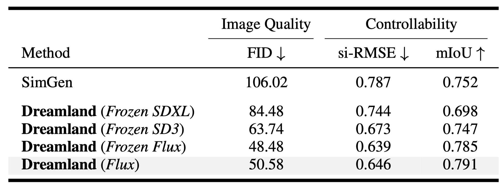
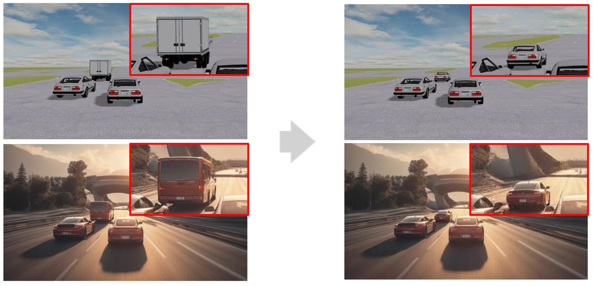

  <video loop autoplay muted playsinline src="../assets/img/dreamland/control_sample_1.mp4"></video>

<!--research-section-splitter-->

## TL; DR

:national_park: **Dreamland** is a hybird generation pipeline that connects simulators and generative models to achieve controllable and configurable world creation.

:robot: **Dreamland** demonstrates great quality and controllability in scene generation, and improves the adaptation of embodied agents to the real world.

<!--research-section-splitter-->

  <figure style="display: flex; flex-direction: column; gap: 8px;">
    <figcaption style="text-align: center; font-size: 30px;">
        <strong>Simulator-Conditioned Generation</strong>
    </figcaption>
    <video id="videoPlayer1" style="display:block; width:100%; height:auto;" muted autoplay loop controls playsinline>
      <source src="../assets/img/dreamland/control_sample_2.mp4" type="video/mp4">
      Your browser does not support the video tag.
    </video>
    

      ●
      ●
    

  </figure>
  <figure style="display: flex; flex-direction: column; gap: 8px;">
  <figcaption style="text-align: center; font-size: 30px;">
        <strong>Diverse Scene Generation</strong>
    </figcaption>
    <video id="videoPlayer2" style="display:block; width:100%; height:auto;" muted autoplay loop controls playsinline>
      <source src="../assets/img/dreamland/text_sample_1.mp4" type="video/mp4">
      Your browser does not support the video tag.
    </video>
    

      ●
      ●
      ●
    

  </figure>
  <figure style="display: flex; flex-direction: column; gap: 8px;">
  <figcaption style="text-align: center; font-size: 30px;">
        <strong>Safety-Critical Scene Generation</strong>
    </figcaption>
    <video id="videoPlayer3" style="display:block; width:100%; height:auto;" muted autoplay loop controls playsinline>
      <source src="../assets/img/dreamland/safe_sample_1.mp4" type="video/mp4">
      Your browser does not support the video tag.
    </video>
    

      ●
      ●
    

  </figure>

<!-- 

 -->

<!--research-section-splitter-->
  
## Dreamland Architecture

    

Dreamland pipeline consists of three key stages: (1) *Stage-1 Simulation* : scene construction with physics-based simulator, (2) *Stage-2 LWA-Sim2Real* : transferring the Sim-LWA from simulation to Real-LWA with an instructional editing model and user instructions, (3) *Stage-3 Mixed-Condition Generation* : rendering an aesthetic and realistic scene with a large-scale pretrained image or video generation model

<!-- 

 -->

<!--research-section-splitter-->

## Experiments

<figure style="display: flex; flex-direction: column; gap: 8px;">
  

  

    ●
    ●
    ●
    ●
  

  </figure>

    

Dreamland demonstrates great **quality** and **controllability**, with **scalability** that benefits from stronger pre-trained model deployed for *Stage-3*.

<!-- 

 -->

<!--research-section-splitter-->

## Scene Editing

    

Dreamland supports editing a generated scene by adjusting the corresponding source scene.

<pre><code class="language-plain">@article{mo2025dreamland,
  title={Dreamland: Controllable World Creation with Simulator and Generative Models},
  author={Sicheng Mo and Ziyang Leng and Leon Liu and Weizhen Wang and Honglin He and Bolei Zhou},
  journal={Preprint},
  year={2025}
}
</code></pre>

<h3 style="margin-top: 30px">Acknowledgement</h3>
<a href="https://github.com/nvidia-cosmos/cosmos-predict1">Cosmos-Predict1</a> and <a href="https://github.com/nvidia-cosmos/cosmos-transfer1">Cosmos-Transfer1</a> were used as the base generation models for video results.

