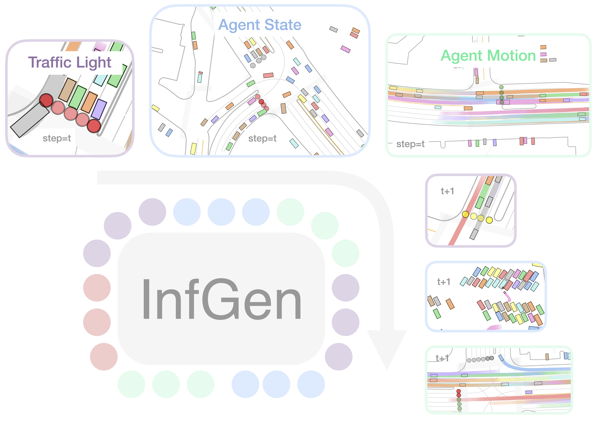

    

 **InfGen** is a unified transformer that treats the entire driving scene—map, lights, agent states and motions—as one long token stream and rolls it out autoregressively.  

&nbsp;
&nbsp;
:traffic_light:
Generates both initial states, traffic light signals, and traffic participant trajectories in a single model.

&nbsp;
&nbsp;
:mag: Supports dynamic agent injection for open-world, long-horizon simulation.

&nbsp;
&nbsp;
:rocket: Autonomous driving planners trained in InfGen scenarios show ↑ robustness & generalization over log-replay baselines.

<!--research-section-splitter-->

  <video loop autoplay muted playsinline src="../assets/img/infgen/infgen_generated_scenario.mp4"></video>

  <video loop autoplay muted playsinline src="../assets/img/infgen/infgen_densified_scenario.mp4"></video>

  <video loop autoplay muted playsinline src="../assets/img/infgen/infgen_densified_and_extended_scenario.mp4"></video>

<!--research-section-splitter-->

<pre><code class="language-plain">@article{peng2025infgen,
  title={InfGen: Scenario Generation as Next Token Group Prediction},
  author={Peng, Zhenghao and Liu, Yuxin and Zhou, Bolei},
  journal={arXiv preprint arXiv:2506.23316},
  year={2025}
}
</code></pre>