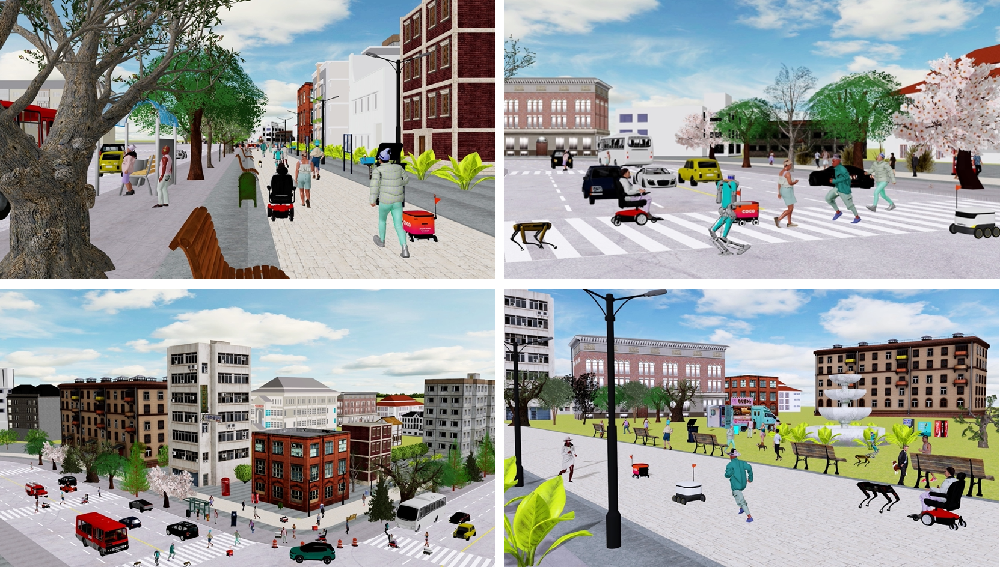

    <h3 style="text-align: center">Release Plan</h3>
    <ul style="list-style-type: none; padding-left: 0;">
      <li style="padding: 0.5rem 0.5rem;">
        <strong>Demo video</strong>: June 12, 2024
      </li>
      <li style="padding: 0.5rem 0.5rem;">
        <strong>Introduction video</strong>:  June 28, 2024
      </li>
      <li style="padding: 0.5rem 0.5rem;">
        <strong>Code of MetaUrban - tiny version</strong>: June 12, 2024
      </li>
      <li style="padding: 0.5rem 0.5rem;">
        <strong>Code of MetaUrban -  official version 1.0</strong>: August 31, 2024
      </li>
    </ul>

MetaUrban Demo

<!-- <video style="display:block; width:100%; height:auto;" controls autoplay loop>
    <source src="https://github.com/Andy-zd/material/releases/download/videos/short_scene_synthesis.mp4" type="video/mp4">
</video> -->
<!--  -->

  <iframe 
    width="100%" 
    height="100%" 
    style="width: 101.5%; height: 101.5%; left: -0.5%; top: -0.5%;" 
    src="https://www.youtube.com/embed/BR2XKjtuy5Q?autoplay=1&mute=1&loop=1&playlist=BR2XKjtuy5Q&controls=1&rel=0&showinfo=0" 
    frameborder="0" 
    allow="autoplay" 
    allowfullscreen="allowfullscreen">
  </iframe>

Public urban spaces like streetscapes and plazas serve residents and accommodate social life in all its vibrant variations.

Recent advances in Robotics and Embodied AI make public urban spaces no longer exclusive to humans. Food delivery bots and electric wheelchairs have started sharing sidewalks with pedestrians, while diverse robot dogs and humanoids have recently emerged in the street. Ensuring the generalizability and safety of these forthcoming mobile machines is crucial when navigating through the bustling streets in urban spaces.

In this work, we present **MetaUrban**, a *compositional* simulation platform for Embodied AI research in urban spaces.
MetaUrban can construct an *infinite* number of interactive urban scenes from compositional elements, covering a vast array of ground plans, object placements, pedestrians, vulnerable road users, and other mobile agents' appearances and dynamics.

We design point navigation and social navigation tasks as the pilot study using MetaUrban for embodied AI research and establish various baselines of Reinforcement Learning and Imitation Learning.

Experiments demonstrate that the compositional nature of the simulated environments can substantially improve the generalizability and safety of the trained mobile agents.

MetaUrban will be made publicly available to provide more research opportunities and foster safe and trustworthy embodied AI in urban spaces. 

