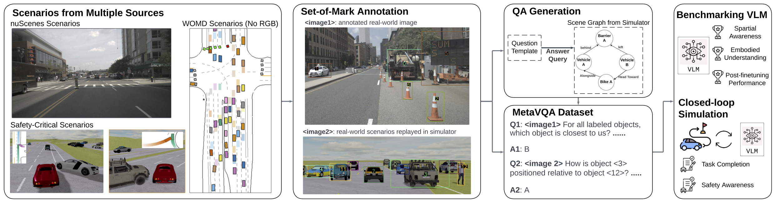
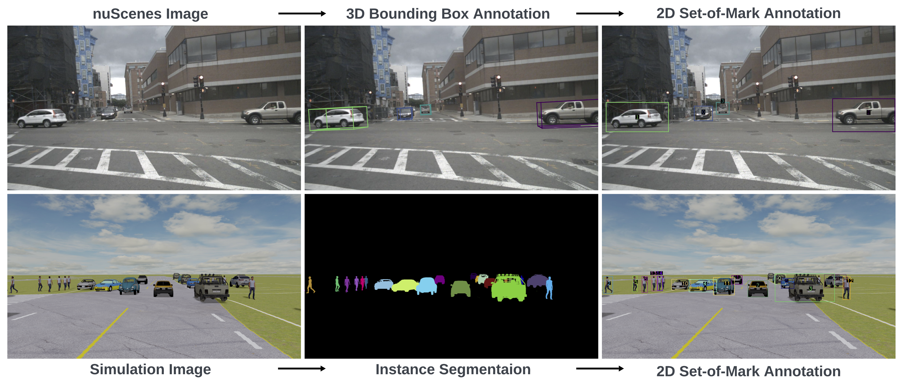
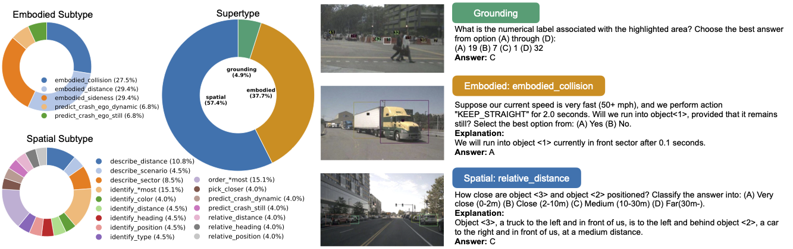
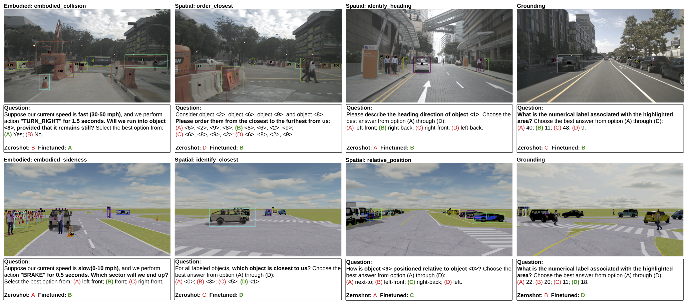
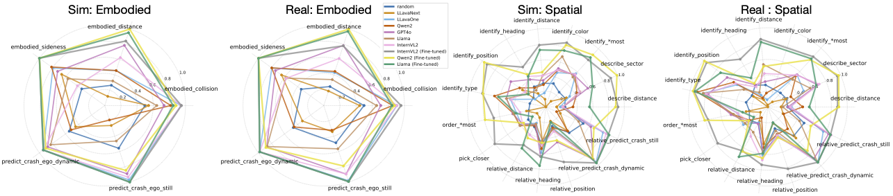
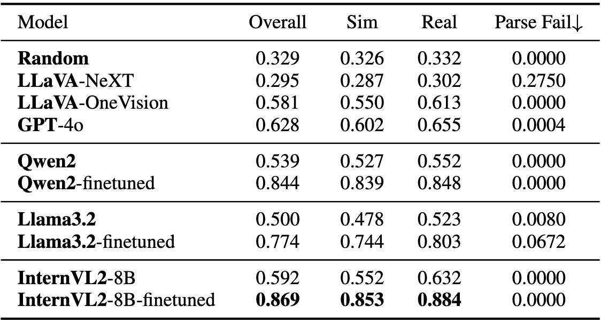
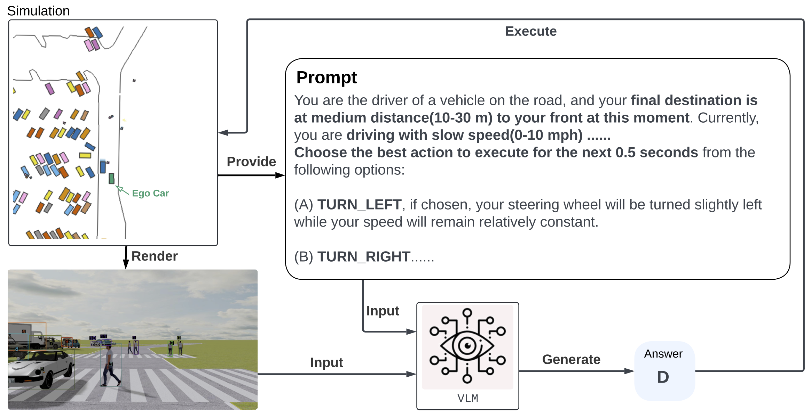
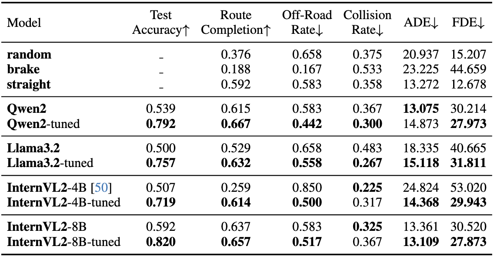

<!-- 

    <a href="#" class="button">PDF (TBD)</a>
    <a href="#" class="button">Arxiv (TBD)</a>
    <a href="#" class="button">GitHub (TBD)</a>
    <a href="#" class="button">Huggingface (TBD)</a>
    <a href="#" class="button">Inspect Dataset (TBD)</a>

 -->

    

        
    

    <ul style="list-style-type: none; padding-left: 0;">
      <strong>TL,DR: </strong> MetaVQA is a holistic benchmark for evaluating and enhancing <strong>general-purpose VLM as embodied agent</strong>.
    </ul>

    <h3 style="text-align: center">Design Choice</h3>
    

        
    

   <strong>Multiple-Choice with Set-of-Marks (SoM)</strong> To effectively communicate with general-purpose vision-language models (VLMs) in visual question answering (VQA) tasks, we draw an analogy to students taking standardized tests, where clear and intuitive instructions ensure fair evaluation. Existing works rely on heterogeneous conventions, like associating pixel coordinates with image regions or using continuous versus discretized spatial information. These conventions, however, are rare in pre-training corpora dominated by human-created Internet data, making it difficult to distinguish whether poor zero-shot performance arises from a lack of scene understanding or unfamiliarity with these conventions. To address these challenges, we adopt the SoM prompting technique, which enhances visual grounding and provides unambiguous, labeled references. By formulating questions in a multiple-choice format with discretized spatial and dynamic information, we ensure fair, intuitive, and zero-shot evaluations. Our benchmark includes 30 question types that comprehensively assess spatial reasoning and embodied understanding through diverse real-world and simulated scenarios, validated further via closed-loop driving simulations.

    <h3 style="text-align: center">Dataset Compositions</h3>
    

        
    

   
<strong>Left</strong>: Distribution of the question types. <strong>Right</strong>: Example for each question supertype.

   
MetaVQA Dataset consists of a large corpus of multiple-choice questions, which contains 4,305,450 questions using 442,102 annotated frames extracted from 400 nuScenes scenarios and 6,900 Waymo scenarios covering 59,682 seconds (16.5 hours) of driving log. The questions can be categorized into three supercategories: <strong>spatial</strong> questions, <strong>embodied</strong> questions, and <strong>grounding</strong> questions. The former two supercategories cover the two facets of embodied scene understanding: spatial awareness and embodied understanding,  and the latter one diagnoses VLMs' capabilities to associate marked objects in the observation with textual referral.

    <h3 style="text-align: center">Learned Embodied Scene Understanding</h3>
    

        
    

    

        <video loop autoplay muted playsinline controls>
            <source src="/assets/img/metavqa/closed_1.mp4" type="video/mp4">
        </video>
    

    

        <video loop autoplay muted playsinline controls>
            <source src="/assets/img/metavqa/closed_2.mp4" type="video/mp4">
        </video>
    

    <strong>Qualitative result of closed-loop evaluation.</strong> We evaluated the performance of vision-language models in a closed-loop driving set up. Case 1 compares the performance of fine-tuned Llama3.2 (left) versus its zero-shot counterpart (right) in the same scenario. Case 2 compares the performance of fine-tuned Llama3.2 (left) versus fine-tuned Qwen2 (right). As shown, fine-tuned Llama3.2 gains elevated situational awareness and can avoid collision. It also demonstrates superior safety capability compared to its trained peers.
    

        
    

    <strong>Improved embodied scene understanding after fine-tuning</strong> of InternVL2-8B on the withheld training set. The VLM demonstrates improved spatial understanding and embodied knowledge after learning the MetaVQA Dataset. In addition, the model attains better grounding capability.

    <h3 style="text-align: center">VQA Benchmarks</h3>
    

        
    

    

        
    

    <strong>Visual question answering benchmark</strong>. Performance comparison of different models on overall, simulation-only-part, and real-only-part of the withheld test sets. The parsing failure rate is also provided. Models report consistent improvements after fine-tuning, with InternVL2-8B achieving the best performance.
    

    <h3 style="text-align: center">Close-Loop Evaluation</h3>
    

        
    

    <strong>Formulation of closed-loop evaluation</strong>. At every five simulation steps (0.5 seconds wall time), the evaluated VLM is provided with annotated observations and current navigation command. The chosen action will be fed into the simulation.
    

        
    

    <strong>Quantitative result of closed-loop evaluation</strong>. Despite not being directly trained on the driving task, VLMs report improvements in closed-loop metrics after learning the MetaVQA Dataset, in addition to better VQA accuracy. This correlation suggests that the MetaVQA Dataset contains generalizable embodied knowledge that could be easily learned and transferred to the downstream application domain (in this case, self-driving).

    <h3 style="text-align: center">Reference</h3>
<pre><code class="language-plain">@article{wang2025metavqa,
  title={Embodied Scene Understanding for Vision Language Models via MetaVQA},
  author={Wang, Weizhen and Duan, Chenda and Peng, Zhenghao and Liu, Yuxin and Zhou, Bolei},
  journal={arXiv preprint arXiv:2501.09167},
  year={2025}
}</code></pre>

