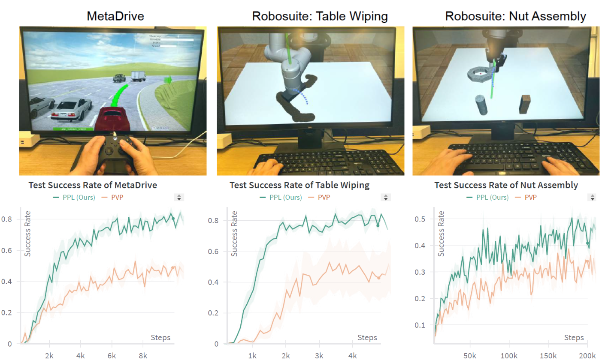

<div class="embed-responsive embed-responsive-16by9" style="width: 70%; margin: 0 auto;">
    <video  loop autoplay muted playsinline src="../assets/img/ppl/longdemo.mp4">
    </video>
</div>
<!--research-section-splitter-->


## Summary

We develop a novel **Predictive Preference Learning from Human Interventions (PPL)** method. 

* PPL predicts future failures with a lightweight trajectory predictor (runs at >1,000 fps on CPU) and helps human experts intervene promptly. 
* PPL converts expert takeovers into contrastive preference labels applied over predicted future states.

In experiments on driving (MetaDrive) and manipulation (RoboSuite), under both  real human participants and neural experts, PPL:

* Achieves 2x improvement in sample efficiency and reduces expert takeover cost compared to interactive imitation learning (IIL) baselines.
* Robust to trajectory-prediction noise and to imperfect experts, and consistently outperforms baselines under these realistic perturbations.

We also provide a theoretical analysis that:

* Upper bounds on the performance gap by the preference-dataset error, state-distribution shift, and training loss.
* Explains how to select the preference horizon $$L$$ to balance these trade-offs.

<!--research-section-splitter-->

## Motivation

<div class="img-container" style="width: 70%; margin: 0 auto;">
    
</div>

<br>


Existing IIL methods impose **high cognitive burdens** on humans as they require humans to constantly monitor the agent, anticipate future failures, and intervene in real time. Moreover, they do not fully utilize the agent's **predicted future behaviors**, resulting in repeated human corrections and poor sample efficiency.

We propose Predictive Preference Learning (PPL) to reduce human workload and improve training efficiency. PPL combines a **lightweight trajectory predictor** and **preference learning**: the former helps humans proactively decide when to intervene, and the latter trains the agent to avoid future unsafe behaviors.

<!--research-section-splitter-->

## Predictive Preference Learning

As illustrated in the figure below, our method PPL operates through human-agent interaction and preference propagation over predicted trajectories.

<div class="img-container" style="width: 90%; margin: 0 auto;">
    
</div>

---

**Agent’s exploratory trajectories**: At each decision step, the agent proposes an action 
$$ a_n $$ 
from its novice policy 
$$ \pi_n $$,
and a future rollout is predicted using a trajectory model 
$$ f(s, a_n, H) $$. 
This rollout 
$$ \tau = (s, \tilde{s}_1, \dots, \tilde{s}_H) $$
is visualized, and the agent proceeds autonomously unless the human anticipates failure.

**Human Demonstrations**: If the expert foresees risk (e.g., collisions), they intervene by suggesting corrective actions 
$$ a_h \sim \pi_h(s) $$,
and we record 
$$ (s, a_h) $$ 
into a human buffer 
$$ \mathcal{D}_h $$
for behavioral cloning. Importantly, we also treat this intervention as an implicit preference: the human prefers 
$$ a_h $$ 
over 
$$ a_n $$
not just at 
$$ s $$,
but also at multiple predicted future states 
$$ \tilde{s}_1, \dots, \tilde{s}_L $$,
forming tuples 
$$ (\tilde{s}_i, a^+ = a_h, a^- = a_n) $$
stored in a preference buffer 
$$ \mathcal{D}_\text{pref} $$.


**Learning with two complementary losses**: We train the policy $$\pi_\theta$$ with:

1) A behavioral cloning loss on expert demonstrations:

 $$\mathcal{L}_{\text{BC}}(\pi_\theta) = -\mathbb{E}_{(s, a_h) \sim \mathcal{D}_h} \left[ \log \pi_\theta(a_h \mid s) \right]$$.  

2) A contrastive preference loss over predicted states:

$$\mathcal{L}_{\text{pref}}(\pi_\theta) = -\mathbb{E}_{(\tilde{s}, a^+, a^-) \sim \mathcal{D}_\text{pref}} \left[ \log \sigma \left( \beta \log \pi_\theta(a^+ \mid \tilde{s}) - \beta \log \pi_\theta(a^- \mid \tilde{s}) \right) \right]$$.

This design allows the agent to propagate expert intent into imagined states before entering risky regions, enabling safer and more efficient policy learning with fewer interventions.

<!--research-section-splitter-->

## Experiment

Compared to the IIL baselines, our method PPL achieves superior learning efficiency in the following tasks:

<div class="img-container" style="width: 80%; margin: 0 auto;">
    
</div>


<br>

Our method PPL saves 40% human demonstrations but achieves better evaluation performance in the MetaDrive environment.

<div class="img-container" style="width: 80%; margin: 0 auto;">
    
</div>


<br>

We also verify that PPL is robust to noises in the trajectory prediction model. Choosing an approximate preference horizon is essential for PPL.

<div class="img-container" style="width: 80%; margin: 0 auto;">
    
</div>


<!--research-section-splitter-->

## Demo Video

<div class="embed-responsive embed-responsive-16by9" style="width: 90%; margin: 0 auto;">
<iframe width="560" height="315" src="https://www.youtube.com/embed/__Zv9C-BiiY?si=G1DTyPRewdfAuoxU" title="YouTube video player" frameborder="0" allow="accelerometer; autoplay; clipboard-write; encrypted-media; gyroscope; picture-in-picture; web-share" referrerpolicy="strict-origin-when-cross-origin" allowfullscreen></iframe>
</div>


<!--research-section-splitter-->

## Related Works from Us


{{ collection_hitl | markdownify }}


<!--research-section-splitter-->

## Reference

**Predictive Preference Learning from Human Interventions (NeurIPS 2025 Spotlight)**:
```plain
@article{cai2025predictive,
  title={Predictive Preference Learning from Human Interventions},
  author={Cai, Haoyuan and Peng, Zhenghao and Zhou, Bolei},
  journal={Advances in Neural Information Processing Systems},
  year={2025}
}   
```


<!-- **Acknowledgement**: The project was supported by NSF grants CCF-2344955 and IIS-2339769. ZP is supported by the Amazon Fellowship via UCLA Science Hub. -->
