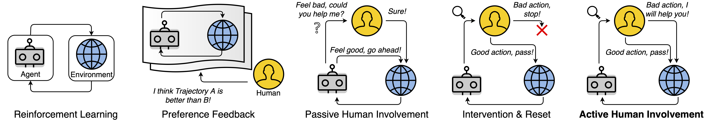
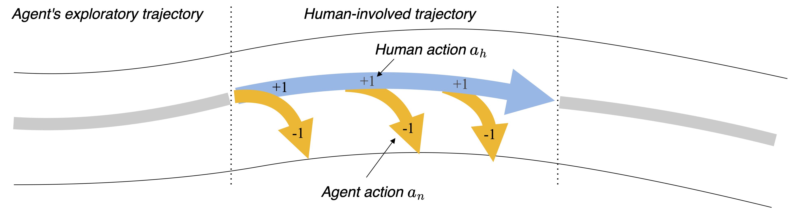
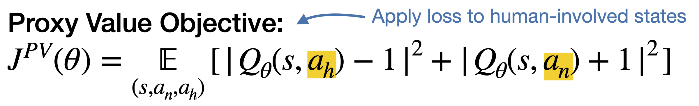
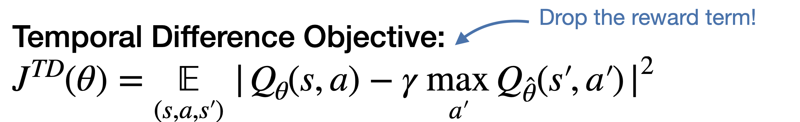
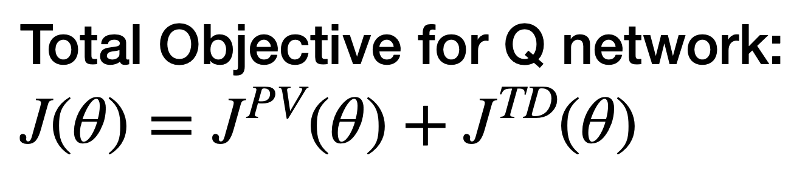
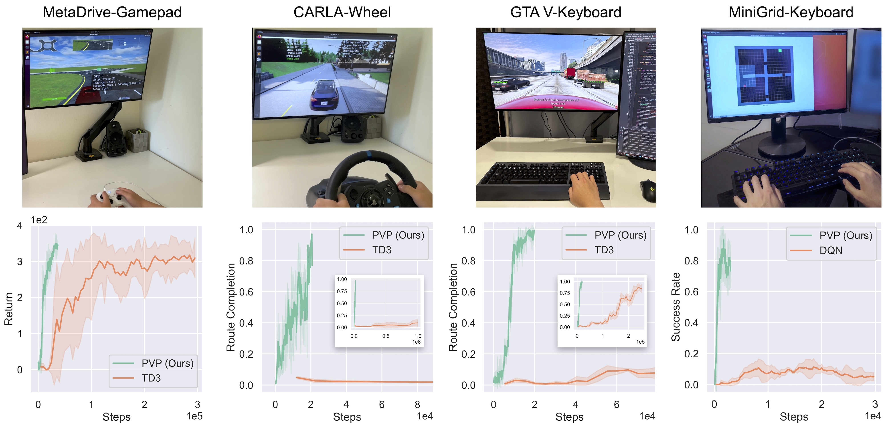
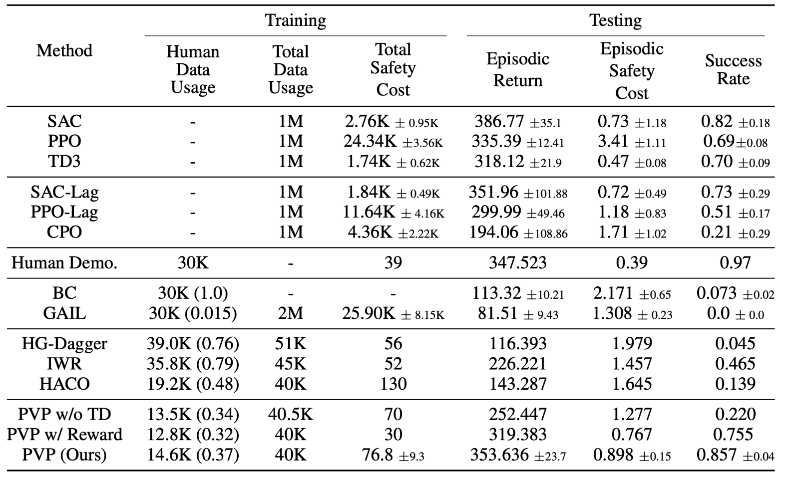
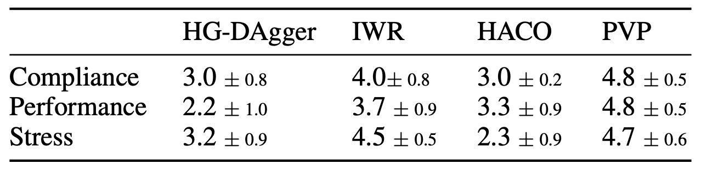

<div class="embed-responsive embed-responsive-16by9">
    <video width="100%" max-width="800px" loop autoplay muted playsinline src="../assets/img/pvp/Teaser-Video-Compressed2.mp4">
    </video>
</div>


<!--research-section-splitter-->

## Introduction Video

*This video includes audio and is about 7 minutes.*

<div id="video" style="overflow: hidden;">
  <iframe width="100%" height="100%" style="width: 101.5%; height: 101.5%; left: -0.5%; top: -0.5%;" src="https://www.youtube.com/embed/6T0ARn5Yioc?autoplay=0&loop=1&controls=1&rel=0&showinfo=0" frameborder="0" allowfullscreen="allowfullscreen"></iframe>
</div>

<!--research-section-splitter-->


## Summary

**Proxy value propagation (PVP)** is a human-in-the-loop policy learning method.

* PVP is reward-free, avoiding sophisticated reward engineering.
* PVP learns from online human interventions and demonstrations, 
ensuring the training-time safety and benefited from corrective feedback.

In real-human experiments on various tasks and various control devices,

* PVP achieves 10x improvement in learning efficiency;
* PVP greatly boosts the agent's training-time and test time safety performance;
* PVP makes human subjects feel better according to an user study.

<!--research-section-splitter-->

## Human-AI Shared Control


<div class="img-container" style="width: 100%; margin: 0 auto;">
    
</div>

<br>

Among different forms of human-in-the-loop approaches, we focus on the **active human involvement**, 
where human experts oversee the exploration processes of the learning agent so that the safety of human-AI system
is ensured.


As shown in the teaser videos, in training-time, the human experts can intervene and provide corrective demonstrations. 
We will discuss how to learn performant and human-aligned policies with the data from human-AI shared control
**without reward function** in the following section.

<!--research-section-splitter-->

## Proxy Value Propagation

We learn a **proxy value function** along with the policy during human-AI shared control.

---

<div class="img-container" style="width: 100%; margin: 0 auto;">
    
</div>

As illustrated in the figure above, we categorize the data into two partitions:

1. The agent's exploratory trajectories;
2. The human-involved trajectories.

**The agent's exploratory trajectories**: The state transitions $$(s, a, s')$$ during agent's exploration will be stored in the Novice Buffer $$\mathcal B_n$$. Note that our method is **reward-free** so no reward is available.


**The human-involved trajectories**: The actions $$a_h$$ provided by the human are applied to the environment, 
while the agent's actions $$a_n$$ are concurrently recorded. 
The state transitions $$(s, a_h, a_n, s')$$ will be stored in the Human Buffer $$\mathcal B_h$$. Again, no reward is stored.

---


<div class="img-container" style="width: 50%; margin: 0 auto;">
    
</div>


The key insight of this paper is to build a proxy value function that induces human-aligned actions and
integrate the proxy value function into a value-based RL framework.

During these human-involved transitions, we optimize the proxy values to ensure the human action approximates a value close to 1, 
while the intervened agent actions approximate a value close to -1:
<div class="img-container" style="width: 60%;">
    
</div>

<br>

The proxy value network $$Q_\theta$$ is updated with both the proxy value objective and the TD objective so that
the proxy value is propagated:
<div class="img-container" style="width: 60%;">
    
</div>
<div class="img-container" style="width: 33%;">
    
</div>


<br>

We then use value-based RL method like TD3 or DQN to optimize the policy with the proxy value function.


<!--research-section-splitter-->

## Experiment

Compared to the RL baselines, our method PVP achieves unprecedented learning efficiency:

<div class="img-container">
    
</div>


<br>

Our method PVP uses fewer demonstrations but achieves less training-time safety violation and better final performance in the MetaDrive environment.

<div class="img-container" style="width: 80%; margin: 0 auto;">
    
</div>


<br>

We also conduct a user study showing that PVP agents make human feels better (compliance), 
stronger (performance) and less stressful (stress) in shared control. 
It also makes human takes over less (above table).


<div class="img-container" style="width: 50%; margin: 0 auto;">
    
</div>


<!--research-section-splitter-->

## Prior Works


**Expert Guided Policy Optimization (CoRL 2021)**:
Our research on human-in-the-loop policy learning began in 2021.
The first published work is [Expert Guided Policy Optimization (EGPO)](https://decisionforce.github.io/EGPO/).
In this work, we explored how an RL agent can benefit from the intervention of a PPO expert.


**Human-AI Copilot Optimization (ICLR 2022)**:
Building upon the methodology of EGPO, and substituting the PPO expert with a real human subject, we proposed [Human-AI Copilot Optimization (HACO)](https://decisionforce.github.io/HACO/) and it demonstrated significant improvements in learning efficiency over traditional RL baselines.


**Teacher-Student Shared Control (ICLR 2023)**:
In [Teacher-Student Shared Control (TS2C)](https://metadriverse.github.io/TS2C/), we examined the impact of using the value function as a criterion for determining when the PPO expert should intervene. The value function-based intervention makes it possible for the student agent to learn from a suboptimal teacher.


**Proxy Value Propagation (NeurIPS 2023 Spotlight)**: Considering the reward-free setting, we proposed several improvements to enhance learning from active human involvement.
These improvements address issues observed in HACO, including the jittering and oscillation of the learning agent, catastrophic forgetting, and challenges in learning sparse yet crucial behaviors.


<!--research-section-splitter-->


## Reference

**Proxy Value Propagation (NeurIPS 2023 Spotlight)**:
```plain
@article{peng2023learning,
  title={Learning from Active Human Involvement through Proxy Value Propagation},
  author={Peng, Zhenghao and Mo, Wenjie and Duan, Chenda and Li, Quanyi and Zhou, Bolei},
  journal={Advances in Neural Information Processing Systems},
  year={2023}
}   
```


<br>

**Acknowledgement**: This work was supported by the National Science Foundation under Grant No. 2235012. The human experiment in this study is approved through the IRB#23-000116 at UCLA.