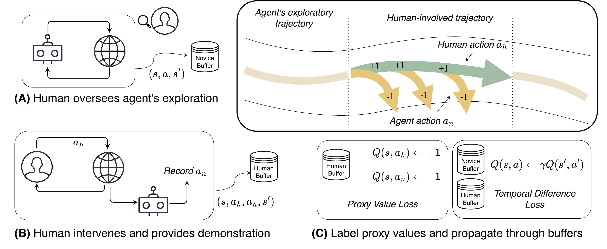

**TL;DR** Training a policy with a human expert in the loop providing interventions and demonstrations, our method achieves 50x improvement in learning efficiency and greatly boost the agent's training-time and test time safety performance.

<!--research-section-splitter-->

## Proxy Value Propagation


We consider a human-AI shared control framework during training:


<div class="img-container" style="width: 80%; margin: 0 auto;">
    
</div>


<br>

The key insight of the paper is to borrow the value-based RL framework but plugging in a proxy value function:

\begin{equation}
    J^\text{PV}(\theta) = 
    \mathbb E_{(s, a_n, a_h)}  [| Q_\theta (s, a_h) - 1 |^2  + | Q_\theta (s, a_n) + 1 |^2 ] I(s, a_n),
\end{equation}

wherein $$I(s, a_n)$$ is an indicator of whether at current step the human is intervening and $$a_n$$, $$a_h$$ are the agent's action and human's action. $$s$$ is the state and $$Q_\theta$$ is the proxy value network.
The $$J^\text{PV}(\theta)$$ basically assigns $$+1$$ to human actions and $$-1$$ to the intervened agent actions.


<br>

Adding the TD loss, we have the objective to update the proxy value. As PVP is **reward-free** does not require the reward, there is no reward term in the TD loss.

\begin{equation}
    J^\text{TD}(\theta) = \mathbb E_{(s, a, s')} | Q_\theta(s, a) -  \gamma \max_{a'} Q_{\hat{\theta}}(s', a') |^2.
\end{equation}


\begin{equation}
J(\theta) = J^\text{PV}(\theta) + J^\text{TD}(\theta) 
\end{equation}


<!--research-section-splitter-->

## Experiment

Compared to the pure RL method, our method PVP achieves unprecedented learning efficiency:

<div class="img-container">
    
</div>


<br>

Our method PVP uses fewer demonstrations but achieves less training-time safety violation and better final performance in the MetaDrive environment.

<div class="img-container" style="width: 80%; margin: 0 auto;">
    
</div>


[//]: # (<!--research-section-splitter-->)

[//]: # (## Experiment Footage)

[//]: # (Coming soon!)

<!--research-section-splitter-->


## Reference

```plain
@article{peng2023learning,
  title={Learning from Active Human Involvement through Proxy Value Propagation},
  author={Peng, Zhenghao and Mo, Wenjie and Duan, Chenda and Li, Quanyi and Zhou, Bolei},
  journal={Advances in Neural Information Processing Systems},
  year={2023}
}   
```
