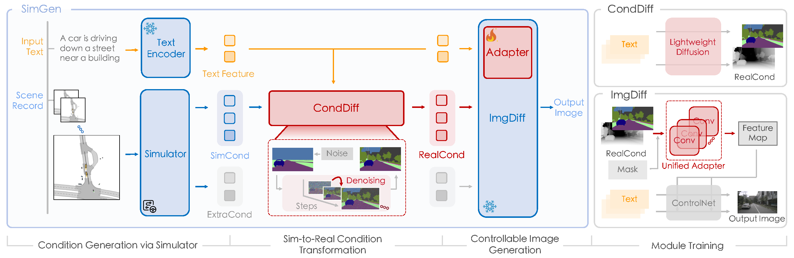
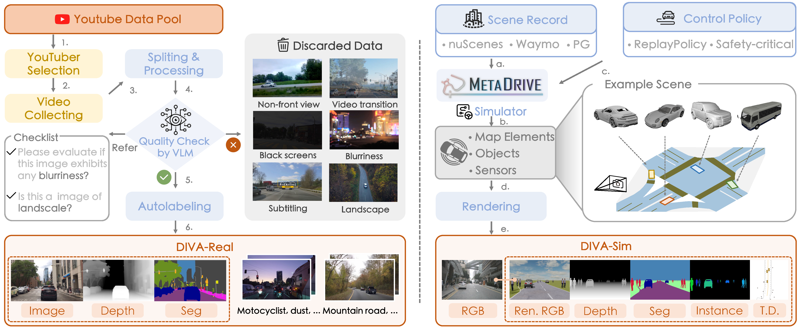
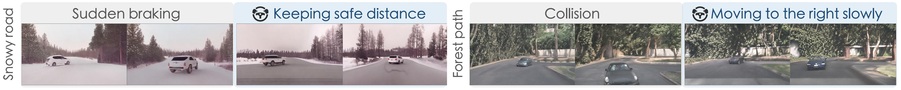

<!---
<div class="img-container" style="width: 100%; margin: 0 auto;">
    
</div>


<style>
.video-container {
  position: relative;
  max-width: 80%; /* Adjust this value to control the maximum width of the video container */
  margin: -30px auto 0; /* Optional: center the video container horizontally */
}

.video-container video {
  display: block;
  margin: 0 auto;
  max-width: 100%;
  max-height: 100%;
}
</style>

<div class="video-container">
  <video loop autoplay muted playsinline src="../assets/img/simgen/SimGenWide.mp4"></video>
</div>


<!---
<div class="embed-responsive embed-responsive-21by9">
    <video width="100%" max-width="800px" loop autoplay muted playsinline src="../assets/img/simgen/SimGenWide.mp4">
    </video>
</div>
--->

TEASER VIDEO HERE


<!--research-section-splitter-->


## TL; DR

:fire: **SimGen** is the first simulator-conditioned generative model for controllable driving scene generation with `appearance` and `layout` diversity.

:star2: **SimGen** addresses simulation to reality `(Sim2Real)` gaps via cascade diffusion paradigm, and follows layout guidance from simulators and cues of the rich text prompts to realistic driving scenarios.

:bar_chart: **DIVA dataset** comprises 147.5 hours of `web videos` and `synthesized data` for diverse scene generation and advancing Sim2Real research.

:robot: We train two mobile robots with human-in-the-loop learning! Our method is:

:star2: Reward-free
* 
:star2: Trained from scratch


Mobile robots are essential in applications like autonomous delivery and hospitality services. 
Traditional rule-based and planning-based methods for navigation face challenges in dynamic environments due to calibration needs, environment modeling and a lack of robustness against unpredictable changes. 
Learning-based methods such as Imitation Learning (IL) and Reinforcement Learning (RL) offer adaptability but require large datasets, carefully crafted reward functions, and face sim-to-real gaps, making them challenging for efficient and safe real-world deployment.

1. We propose an online human-in-the-loop learning method that combines IL and RL to address these issues. 
2. Our approach enables efficient, real-time policy learning from online human intervention, significantly improving data efficiency and training safety. 
3. We validate our method by training two different robots --- a legged quadruped, and a wheeled delivery robot --- in two mobile robot tasks, one of which even uses raw RGBD image as observation.
4. The training finishes within 10 minutes. Our experiments demonstrate that online human-in-the-loop learning can achieve high efficiency and effectiveness in real-world robotic training.


<!--research-section-splitter-->


## Efficient Human-in-the-loop Learning

<!--research-section-splitter-->


## Zero-shot Deployment


<!--research-section-splitter-->


## Comparison with Baselines


<!--research-section-splitter-->


<div class="img-container" style="width: 100%; margin: 0 auto;">
    
</div>

SimGen processes text and scene record as inputs. The text is feature-encoded and utilized in the subsequent modules, whereas the scene record undergoes a simulator rendering into simulated depth and segmentation (SimCond) and extra conditions (ExtraCond).
SimCond, coupled with the text features, is fed into the CondDiff module that converts SimCond into RealCond, representing real depth and segmentation. Eventually, the text features, SimCond, and ExtraCond are inputted into the ImgDiff module, where an Adapter merges multi-source conditions into a unified control condition and generates driving scene images.

<!--research-section-splitter-->

## DIVA Dataset

<!---
<div class="img-container" style="width: 100%; margin: 0 auto;">
    
</div>


**Data Collection.** DIVA-Real (left) comprises driving videos collected from YouTube. We apply a Vision Language Model to filter out noisy images via a checklist and utilize off-the-shelf models to annotate text, depth, and semantic labels. Meanwhile, DIVA-Sim (right) employs scene records and control policies in a simulator to create map elements and objects.
It can generate digital twins of real-world data and safety-critical scenes. 
Then various kinds of sensors placed in the simulation produce multimodal images.


<div class="img-container" style="width: 100%; margin: 0 auto;">
    
</div>

**DIVA-Real.** 
It collects driving videos from YouTube, covering a worldwide range of geography, weather, scenes, and traffic elements and preserving the appearance diversity of a wide range of traffic participants. Here we provide a sample of 🔗 [YouTube video list](https://docs.google.com/spreadsheets/d/1lKfd0iARpJl-5K37XSXRwiZIWi1LrTvL/edit?usp=sharing&ouid=102597623866661259117&rtpof=true&sd=true) we used.
For privacy considerations, we are temporarily keeping the complete data labels private.

<div class="img-container" style="width: 100%; margin: 0 auto;">
    
</div>


**DIVA-Sim.** 
The Sim2Real data is induced from the same real-world scenarios, in which we can obtain real-world map topology, layout, and raw sensor data.
It also includes hazardous driving behaviors through interactions introduced by adversarial traffic generation.
The digital twins (on nuScenes dataset) and safety-critical scenarios (on Waymo Open dataset) can be obtained through this :link:[data link](https://drive.google.com/drive/folders/1K7NrujRlfyI6VrH6Kd9kTHCeKnpl4bab?usp=sharing). 

--->

<!--research-section-splitter-->


## Experiment


<div class="img-container">
    
</div>

> SimGen improves over counterparts in terms of image quality, diversity, and controllability of scene generation.


<div class="img-container">
    
</div>

> We show the generation results of SimGen (blue boxes) under simulator conditions. 
Compared to models confined to limited datasets, SimGen exhibits a stronger ability to generate more realistic and diverse driving scenarios.


<div class="img-container">
    
</div>

> SimGen can also recreate image sequences of safety-critical scenes where risky driving behaviors like sudden braking and merging happen. And the effectiveness of each modality in simulator conditions is exhibited, where instance map, rendered RGB, and top-down view enable the model to better handle object boundaries, orientation angles, and occlusions.


<div class="img-container">
    
</div>

> We further explore applying SimGen to the closed-loop evaluation. The evaluation focuses on two driving behaviors, namely IDM (gray boxes) and manual control (blue boxes) in different scenarios. IDM could lead to risks like sudden braking or collision in these cases. Conversely, manual control promotes safety by maintaining distance and slowing down. 


<!--research-section-splitter-->


<!--research-section-splitter-->


## Reference

**Proxy Value Propagation (NeurIPS 2023 Spotlight)**:
```plain
@article{peng2023learning,
  title={Learning from Active Human Involvement through Proxy Value Propagation},
  author={Peng, Zhenghao and Mo, Wenjie and Duan, Chenda and Li, Quanyi and Zhou, Bolei},
  journal={Advances in Neural Information Processing Systems},
  year={2023}
}   
```


<br>

**Acknowledgement**: TODOTODOTODOTODOTODOTODOTODOTODOTODOTODOTODOTODOTODOTODO 
This work was supported by the National Science Foundation under Grant No. 2235012. The human experiment in this study is approved through the IRB#23-000116 


<!--research-section-splitter-->


## Prior Works


**Expert Guided Policy Optimization (CoRL 2021)**:
Our research on human-in-the-loop policy learning began in 2021.
The first published work is [Expert Guided Policy Optimization (EGPO)](https://decisionforce.github.io/EGPO/).
In this work, we explored how an RL agent can benefit from the intervention of a PPO expert.


**Human-AI Copilot Optimization (ICLR 2022)**:
Building upon the methodology of EGPO, and substituting the PPO expert with a real human subject, we proposed [Human-AI Copilot Optimization (HACO)](https://decisionforce.github.io/HACO/) and it demonstrated significant improvements in learning efficiency over traditional RL baselines.


**Teacher-Student Shared Control (ICLR 2023)**:
In [Teacher-Student Shared Control (TS2C)](https://metadriverse.github.io/TS2C/), we examined the impact of using the value function as a criterion for determining when the PPO expert should intervene. The value function-based intervention makes it possible for the student agent to learn from a suboptimal teacher.


**Proxy Value Propagation (NeurIPS 2023 Spotlight)**: Considering the reward-free setting, we proposed several improvements to enhance learning from active human involvement.
These improvements address issues observed in HACO, including the jittering and oscillation of the learning agent, catastrophic forgetting, and challenges in learning sparse yet crucial behaviors.

