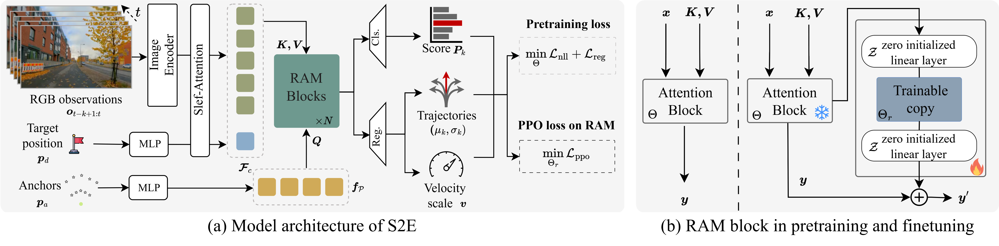
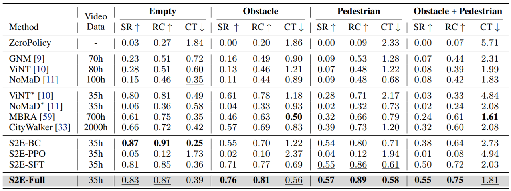

  <video loop autoplay muted playsinline src="../assets/img/s2e/s2e.mp4"></video>

    <h3 style="text-align: center">TL;DR</h3>
    <ul style="list-style-type: none; padding-left: 0;">
      <strong>S2E</strong> is a <em>unified</em> learning framework that scales navigation foundation models from passive offline video to interactive decision-making through reinforcement learning.  
    1. 📦 Provides a general framework for learning navigation from both offline data and online interaction. 
    2. 🔌 Introduces a plug-and-play <strong>Residual-Attention Module</strong> for efficient adaptation and scaling in RL. 
    3. 🧭 Releases <strong>NavBench-GS</strong>, a realistic 3D Gaussian Splatting benchmark for evaluating navigation performance in closed-loop, interactive, and physically grounded environments.
  </ul>

    <h3 style="text-align: center">S2E Model Architecture</h3>
  
    
    
    

    S2E pipeline consists of two key components: 
    (1) Anchor-Guided Distribution Matching (AGDM): A framework that uses anchor-conditioned architecture to learn multi-modal trajectory distributions from offline real-world videos, improving model capability from the side of representation. 
    (2) Residual Attention Module (RAM): A lightweight residual design that fine-tunes pretrained attention blocks via reinforcement learning in simulation, enabling new behaviors (e.g., obstacle avoidance) while preserving general visual-motor priors.
     

    <h3 style="text-align: center">Environments for Pretraining and Finetuning</h3>

    <h4 style="text-align: center">Pretraining on Video Datasets</h4>
    <video style="display:block; width:100%; height:auto;" autoplay="autoplay" muted loop="loop" controls playsinline><source src="../assets/img/s2e/pretrain.mp4" type="video/mp4"/> </video>

    <h4 style="text-align: center">Finetuning on URBAN-SIM Simulator</h4>
    <video style="display:block; width:100%; height:auto;" autoplay="autoplay" muted loop="loop" controls playsinline><source src="../assets/img/s2e/finetune.mp4" type="video/mp4"/> </video>
    

    <h3 style="text-align: center">NavBench-GS: Closed-Loop 3DGS Navigation Benchmark</h3>
    
    <video style="display:block; width:100%; height:auto;" autoplay="autoplay" muted loop="loop" controls playsinline><source src="../assets/img/s2e/navbench_gs.mp4" type="video/mp4"/> </video>

    

    

        We build NavBench-GS, a 3D Gaussian Splatting-based benchmark for evaluating navigation policies in closed-loop, visually reconstructed urban environments with simulated objects and pedestrians.
    

    

    <h3 style="text-align: center">Real World Deployment</h3>

    <video style="display:block; width:100%; height:auto;" autoplay="autoplay" muted loop="loop" controls playsinline><source src="../assets/img/s2e/obstacles.mp4" type="video/mp4"/> </video>
    

    Scenarios with Static Obstacles
    

    
    <video style="display:block; width:100%; height:auto;" autoplay="autoplay" muted loop="loop" controls playsinline><source src="../assets/img/s2e/pedestrians.mp4" type="video/mp4"/> </video>
    

    Scenarios with Dynamic Pedestrians
    

    <video style="display:block; width:100%; height:auto;" autoplay="autoplay" muted loop="loop" controls playsinline><source src="../assets/img/s2e/longnav.mp4" type="video/mp4"/> </video>
    

    Long-Horizon Navigation
    

    <video style="display:block; width:100%; height:auto;" autoplay="autoplay" muted loop="loop" controls playsinline><source src="../assets/img/s2e/comparisons.mp4" type="video/mp4"/> </video>
    

    Comparison with SOTAs
    

    

<h3 style="text-align: center">Acknowledgement</h3>

We extend our gratitude for the excellent assets, including 3D objects from Objaverse-XL, 3D humans from SynBody, and robots from IsaacLab. Thank <a href="https://www.cocodelivery.com/" target="_blank">COCO Robot</a> for donating virtual and physical robots.

<h3 style="text-align: center">Reference</h3>

<pre><code class="language-plain">@article{he2025from,
  title={From Seeing to Experiencing: Scaling Navigation Foundation Models with Reinforcement Learning},
  author={He, Honglin and Ma, Yukai and Wu, Wayne and Zhou, Bolei},
  journal={arXiv preprint arXiv:2507.22028},
  year={2025}
}
</code></pre>

