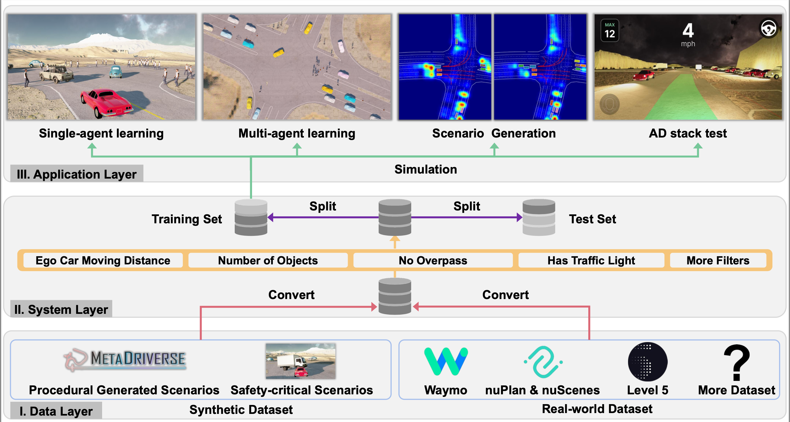

    <!-- Mobile layout -->
    

        <h2 style="color: white; text-shadow: 2px 2px 4px rgba(0, 0, 0, 0.7); font-weight: bold;">ScenarioNet</h2>
        
Open-source platform for large-scale traffic scenario modeling and simulation

    

    <!-- Video embed -->
    

        <iframe width="560" height="315" src="https://www.youtube.com/embed/C3DwU7GHJe0?autoplay=1&mute=1&loop=1&playlist=C3DwU7GHJe0" frameborder="0" allow="accelerometer; autoplay; clipboard-write; encrypted-media; gyroscope; picture-in-picture" allowfullscreen></iframe>
        <!-- Desktop layout -->
        

            <h2 style="color: white; text-shadow: 3px 3px 6px rgba(0, 0, 0, 0.7); font-weight: bold;">ScenarioNet</h2>
            
Open-source platform for large-scale traffic scenario modeling and simulation

        

    

    
    <h3 style="text-align: center">Meet ScenarioNet</h3>
    
<b>ScenarioNet</b> is an open-sourced platform for large-scale traffic scenario modeling and simulation:

<li>  
It processes various sources of the input data, including procedurally generated scenarios, 
human-crafted safety-critical data, and more importantly real-world data. 
</li><li>
It provides a unified interface to easily import and convert the data from various driving dataset such as Waymo, nuScenes, Lyft L5, and nuPlan datasets.
</li><li>
These realistic data can be further replayed and interact in our simulation environment, MetaDrive.
</li>

<li>
    <b>ScenarioNet</b> reads from real world dataset such as Waymo, nuScenes, Lyft L5, and nuPlan datasets and creates
interactive environment for closed-loop simulation.
</li>
    <video width="100%" max-width="800px" loop autoplay muted playsinline
    src="../assets/scenarionet/sn_convert.mp4">
    </video>

<li>
    <b>ScenarioNet</b> bridges OpenPilot (Left) and ROS (Right) for autonomous driving testing.
</li>
<iframe width="47%" height="230px" src="https://www.youtube.com/embed/KjlPB0nCTvg?autoplay=1&loop=1&mute=1&playlist=KjlPB0nCTvg" frameborder="0" allow="accelerometer; autoplay; clipboard-write; encrypted-media; gyroscope; picture-in-picture" allowfullscreen></iframe>
<iframe width="47%" height="230px" src="https://www.youtube.com/embed/WWwdnURnOBM?t=10&loop=1&autoplay=1&mute=1&playlist=WWwdnURnOBM" frameborder="0" allow="accelerometer; autoplay; clipboard-write; encrypted-media; gyroscope; picture-in-picture" allowfullscreen></iframe>

<li>
    <b>ScenarioNet</b> leverages <a href="../metadrive">MetaDrive Simulator</a> for multi-modal observation simulation.
</li>
    <video width="100%" max-width="800px" loop autoplay muted playsinline
    src="../assets/scenarionet/sn_sensors.mp4">
    </video>

 
    <h3 style="text-align: center">ScenarioNet's System Design</h3>

<b>ScenarioNet</b> ... Some description here.
    

    

        
    

