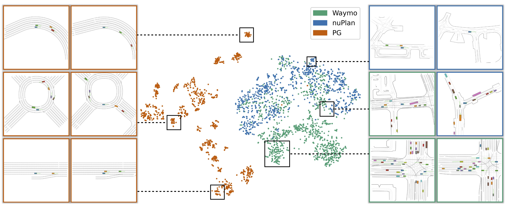

<div class="col-12 position-relative">
    <!-- Mobile layout -->
    <div class="d-block d-sm-none text-center mb-3">
        <h2 style="color: white; text-shadow: 2px 2px 4px rgba(0, 0, 0, 0.7); font-weight: bold;">ScenarioNet</h2>
        <p style="color: white; text-shadow: 2px 2px 4px rgba(0, 0, 0, 0.7); font-size: 1.2em; font-weight: bold;">Open-source platform for large-scale traffic scenario modeling and simulation</p>
    </div>
    <!-- Video embed -->
    <div class="embed-responsive embed-responsive-16by9">
<!--
<iframe width="560" height="315" src="https://www.youtube.com/embed/C3DwU7GHJe0?autoplay=1&mute=1&loop=1&playlist=C3DwU7GHJe0" frameborder="0" allow="accelerometer; autoplay; clipboard-write; encrypted-media; gyroscope; picture-in-picture" allowfullscreen></iframe>
-->
<video width="100%" max-width="800px" loop autoplay muted playsinline
    src="../assets/scenarionet/teaser_video.mp4">
    </video>
<!-- Desktop layout -->
        <div class="position-absolute w-100 h-100 d-none d-sm-flex flex-column align-items-center justify-content-center text-center" style="top: 0; left: 0;">
            <h1 style="color: white; text-shadow: 3px 3px 6px rgba(0, 0, 0, 0.7); font-weight: bold;">ScenarioNet</h1>
            <p style="color: white; text-shadow: 2px 2px 4px rgba(0, 0, 0, 0.7); font-size: 1.2em; font-weight: bold;">Open-source platform for large-scale traffic scenario modeling and simulation</p>
        </div>
    </div>
</div>

<!-- Disable changing the color of a clicked link -->
<style>
a:link, a:visited, a:hover, a:active {
    color: var(--global-text-color);
    text-decoration: none;
}
</style>

<div class="col-12 md-5" style="margin-top: 3em;" align="center">
<h5 style="text-align: center">
<a href="https://metadriverse.github.io/scenarionet/"><b>Webpage</b></a> |
<a  href="https://github.com/metadriverse/scenarionet"><b>Code</b></a> |
<a  href="https://youtu.be/3bOqswXP6OA"><b>Video</b></a> |
<a  href="https://arxiv.org/abs/2306.12241"><b>Paper</b></a> |
<a  href="/snetasset/snet-asset.html"><b>Browse Scenario</b></a>
</h5>
</div>

<div class="col-12 md-5" style="margin-top: 3em;">    
    <h3 style="text-align: center">Meet ScenarioNet</h3>
    <p><b>ScenarioNet</b> is an open-sourced platform for large-scale traffic scenario modeling and simulation.</p>
<li style="padding: 0.5rem 0.5rem;">
ScenarioNet defines a unified scenario description format containing HD maps and detailed object annotations.
</li><li style="padding: 0.5rem 0.5rem;">
Scenarios recorded in this format can be replayed in the digital twins with multiple views, ranging from Bird-Eye-View layout to realistic 3D rendering.
<!-- reflect the real-world complexity of traffic behaviors, substantially accelerating autonomous driving research. --> 
<!-- repository of real-world traffic scenarios from the heterogeneous data in various driving datasets including Waymo, nuScenes, Lyft L5, and nuPlan datasets. --> 
<!-- All scenario description files contain HD maps and detailed annotations which accurately reflect the real-world complexity of traffic behaviors, substantially accelerating autonomous driving research. -->
</li><li style="padding: 0.5rem 0.5rem;">
<!-- For harvesting a massive number of traffic scenarios, -->
ScenarioNet provides tools to build and manage databases
built from various data sources including real-world datasets like Waymo, nuScenes, Lyft L5, and nuPlan datasets and synthetic datasets like the procedural generated ones and safety-critical ones.

<!-- ScenarioNet pipelines those scenarios and creates log-replayed or interactive environments --> 
<!-- with in multiple views from Bird-Eye-View layout to realistic 3D rendering in MetaDrive simulator, --> 
<!-- providing a benchmark for training ML-based driving policies and evaluating the safety of autonomous driving stacks in simulation before their real-world deployment. -->  
</li><li style="padding: 0.5rem 0.5rem;">
We demonstrate several applications of ScenarioNet including large-scale scenario generation, AD testing, imitation learning, and reinforcement learning in both single-agent and multi-agent settings.
The results imply scaling up the training data brings new research opportunities in machine learning and autonomous driving.  

<!-- Allowing harvesting a massive number of complex traffic scenarios and recreate their digital twins in simulation, we hope <b>ScenarioNet</b> can facilitate many research opportunities in machine learning and autonomous driving. -->
</li>
</div>


<div class="col-12" style="margin-top: 3em;"> 
    <h3 style="text-align: center">ScenarioNet's System Design</h3>
    <div class="img-container">
        
    </div>
    <div class="description" style="margin-top: 1em;">
<b>ScenarioNet</b>  consists of the data layer, system layer, and application layer.
Various datasets are unified into an internal scenario description.
The system layer then provides a set of tools to operate on data efficiently, such as filtering, merging, sanity-check, 
splitting and so on.
Once the database is ready, it can be loaded into MetaDrive for large-scale simulation and supports applications. 
    </div>
</div>


<div class="col-12" style="margin-top: 3em;"> 
    <h3 style="text-align: center">Multi-sensory Simulation</h3>
    <video width="100%" max-width="800px" loop autoplay muted playsinline
    src="../assets/scenarionet/sn_sensors_cropped.mp4">
    </video>
    <div class="description">
        <b>ScenarioNet</b> leverages <a href="../metadrive">MetaDrive Simulator</a> for multi-modal observation simulation.
    </div>
</div>


<div class="col-12" style="margin-top: 3em;"> 
    <h3 style="text-align: center">Traffic Scenarios from Various Datasets</h3>
    <video width="100%" max-width="800px" loop autoplay muted playsinline
    src="../assets/scenarionet/montage.mp4">
    </video>
<div class="description">
    <b>ScenarioNet</b> reads from real world dataset such as Waymo, nuScenes, Lyft L5, and nuPlan datasets and creates
interactive environment for closed-loop simulation.
    </div>
</div>


<div class="col-12" style="margin-top: 3em;"> 
    <h3 style="text-align: center">tSNE Visualization of Scenario Embeddings</h3>
    
</div>


<div class="col-12 md-5" style="margin-top: 3em;">
<h3 style="text-align: center">AD Stack Testing</h3>
<iframe width="47%" height="310px" src="https://www.youtube.com/embed/KjlPB0nCTvg?autoplay=1&loop=1&mute=1&playlist=KjlPB0nCTvg" frameborder="0" allow="accelerometer; autoplay; clipboard-write; encrypted-media; gyroscope; picture-in-picture" allowfullscreen></iframe>
<iframe width="47%" height="310px" src="https://www.youtube.com/embed/WWwdnURnOBM?t=10&loop=1&autoplay=1&mute=1&playlist=WWwdnURnOBM" frameborder="0" allow="accelerometer; autoplay; clipboard-write; encrypted-media; gyroscope; picture-in-picture" allowfullscreen></iframe>
    <div class="description">
        <b>ScenarioNet</b> bridges OpenPilot (Left) and ROS (Right) for autonomous driving testing.
    </div>
</div>


### Reference

```
@article{li2023scenarionet,
  title={ScenarioNet: Open-Source Platform for Large-Scale Traffic Scenario Simulation and Modeling},
  author={Li, Quanyi and Peng, Zhenghao and Feng, Lan and Liu, Zhizheng and Duan, Chenda and Mo, Wenjie and Zhou, Bolei},
  journal={Advances in Neural Information Processing Systems},
  year={2023}
}
```
