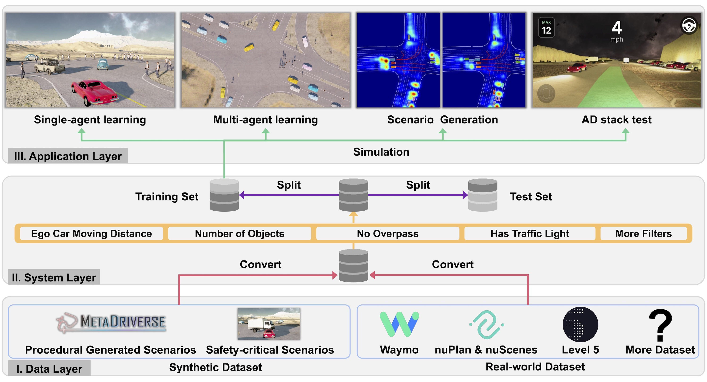

    <!-- Mobile layout -->
    

        <h2 style="color: white; text-shadow: 2px 2px 4px rgba(0, 0, 0, 0.7); font-weight: bold;">ScenarioNet</h2>
        
Open-source platform for large-scale traffic scenario modeling and simulation

    

    <!-- Video embed -->
    

        <iframe width="560" height="315" src="https://www.youtube.com/embed/C3DwU7GHJe0?autoplay=1&mute=1&loop=1&playlist=C3DwU7GHJe0" frameborder="0" allow="accelerometer; autoplay; clipboard-write; encrypted-media; gyroscope; picture-in-picture" allowfullscreen></iframe>
        <!-- Desktop layout -->
        

            <h2 style="color: white; text-shadow: 3px 3px 6px rgba(0, 0, 0, 0.7); font-weight: bold;">ScenarioNet</h2>
            
Open-source platform for large-scale traffic scenario modeling and simulation

        

    

    
    <h3 style="text-align: center">Meet ScenarioNet</h3>
    
<b>ScenarioNet</b> is an open-sourced platform for large-scale traffic scenario modeling and simulation.

<li style="padding: 0.5rem 0.5rem;">
Large-scale driving datasets contain HD maps and detailed annotations which accurately reflect the real-world complexity of traffic behaviors, substantially accelerating autonomous driving research.
</li><li style="padding: 0.5rem 0.5rem;">
We can harvest a massive number of complex traffic scenarios and recreate their digital twins in simulation, for facilitating many research opportunities in machine learning and autonomous driving. 
</li><li style="padding: 0.5rem 0.5rem;">
ScenarioNet defines a unified scenario description format and collects a large-scale 
repository of real-world traffic scenarios from the heterogeneous data in various driving datasets including Waymo, nuScenes, Lyft L5, and nuPlan datasets. 
</li><li style="padding: 0.5rem 0.5rem;">
ScenarioNet pipelines those scenarios and creates log-replayed or interactive environments
with in multiple views from Bird-Eye-View layout to realistic 3D rendering in MetaDrive simulator,
providing a benchmark for evaluating the safety of autonomous driving stacks in simulation before their real-world 
deployment.
</li><li style="padding: 0.5rem 0.5rem;">
We demonstrate the strengths of ScenarioNet on large-scale scenario generation, AD testing, imitation learning, and reinforcement learning in both single-agent and multi-agent settings. 
</li>

    <video width="100%" max-width="800px" loop autoplay muted playsinline
    src="../assets/scenarionet/sn_convert.mp4">
    </video>
    

    <b>ScenarioNet</b> reads from real world dataset such as Waymo, nuScenes, Lyft L5, and nuPlan datasets and creates
interactive environment for closed-loop simulation.
    

<iframe width="47%" height="230px" src="https://www.youtube.com/embed/KjlPB0nCTvg?autoplay=1&loop=1&mute=1&playlist=KjlPB0nCTvg" frameborder="0" allow="accelerometer; autoplay; clipboard-write; encrypted-media; gyroscope; picture-in-picture" allowfullscreen></iframe>
<iframe width="47%" height="230px" src="https://www.youtube.com/embed/WWwdnURnOBM?t=10&loop=1&autoplay=1&mute=1&playlist=WWwdnURnOBM" frameborder="0" allow="accelerometer; autoplay; clipboard-write; encrypted-media; gyroscope; picture-in-picture" allowfullscreen></iframe>
    

        <b>ScenarioNet</b> bridges OpenPilot (Left) and ROS (Right) for autonomous driving testing.
    

    <video width="100%" max-width="800px" loop autoplay muted playsinline
    src="../assets/scenarionet/sn_sensors.mp4">
    </video>
    

        <b>ScenarioNet</b> leverages <a href="../metadrive">MetaDrive Simulator</a> for multi-modal observation simulation.
    

 
    <h3 style="text-align: center">ScenarioNet's System Design</h3>
    

        
    

    

From bottom to top, <b>ScenarioNet</b>  consists of the data layer, system layer, and application layer which are connected by two critical data flows, 
data conversion
and 
simulation
.
Data conversing unifies various data formats and stored them in an internal scenario description.
The system layer then provides a set of tools to operate converted data efficiently, such as
filtering
, merging, sanity-check, 
splitting
 and so on.
Once the database is ready, it can be loaded into MetaDrive for large-scale simulation and supports applications. 
    

