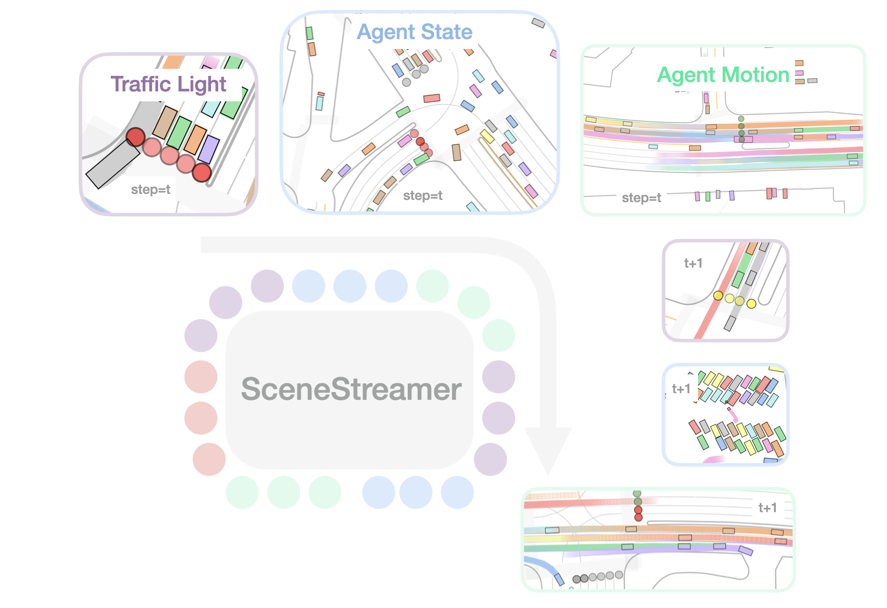
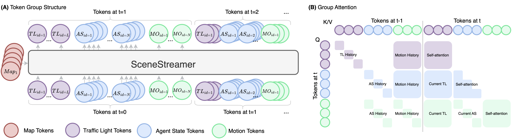

<style>
.video-container {
  position: relative;
  max-width: 100%;
  margin: 0 auto 0;
}

.video-container video {
  display: block;
  margin: 0 auto;
  max-width: 100%;
  max-height: 100%;
}

.video-grid {
    display: grid;
    grid-template-columns: 1fr 1fr;
    grid-gap: 20px;
}
.video iframe {
    width: 100%;
    height: 250px;
}

@media (max-width: 600px) {
    .video-grid {
        grid-template-columns: 1fr;
    }
}
</style>


<div class="img-container" style="width: 80%; margin: auto auto;">
    
</div>


**SceneStreamer** is a unified autoregressive transformer that treats the entire driving scene—map, traffic lights, agent states, and motions—as one long token stream and rolls it out step-by-step, enabling realistic, interactive, and infinitely extensible traffic simulation.


&nbsp;
&nbsp;
:traffic_light:
Generates traffic light signals, agent initial states, and traffic participant trajectories in a single model—no separate initialization or motion prediction stages needed.

&nbsp;
&nbsp;
:mag: Supports dynamic agent injection for open-world, long-horizon simulation. New agents can appear (and existing ones can leave) at any timestep.

&nbsp;
&nbsp;
:rocket: Autonomous driving planners trained in SceneStreamer-generated scenarios show improved robustness and generalization over log-replay baselines.


<!--research-section-splitter-->


## Abstract

Realistic and interactive traffic simulation is essential for training and evaluating autonomous driving systems. However, most existing data-driven simulation methods rely on static initialization or log-replay data, limiting their ability to model dynamic, long-horizon scenarios with evolving agent populations. We propose **SceneStreamer**, a scenario generation framework that outputs agent states and trajectories in an autoregressive manner. SceneStreamer represents the entire scene as a sequence of tokens—including traffic light signals, agent states, and motion vectors—and uses a transformer model to simulate traffic over time. This design enables SceneStreamer to continuously insert new agents into traffic, supporting infinite scene generation. Experiments demonstrate that SceneStreamer produces realistic, diverse, and adaptive traffic behaviors. Furthermore, reinforcement learning policies trained in SceneStreamer-generated scenarios achieve superior robustness and generalization, validating its utility as a high-fidelity simulation environment for autonomous driving.


<!--research-section-splitter-->


## Method Overview


<div class="img-container" style="width: 100%; margin: 0 auto;">
    
</div>


SceneStreamer casts scenario generation as a **next-token-group prediction** task. The entire driving scene is represented as a structured sequence of discrete tokens, organized into four groups per simulation step:

- **Map Tokens** ⟨MAP⟩: Static lane segments, crosswalks, and road features encoded via a PointNet-like encoder, serving as fixed cross-attention context throughout simulation.
- **Traffic Light Tokens** ⟨TL⟩: Discrete signal states (green, yellow, red) for each traffic light, anchored to their associated map segments.
- **Agent State Tokens** ⟨AS⟩: Four ordered tokens per agent—start-of-agent flag, category type, map segment index, and relative kinematic state—enabling autoregressive agent creation at any timestep.
- **Motion Tokens** ⟨MO⟩: Discretized acceleration and yaw rate pairs, applied via a bicycle model to advance agent states forward.

At each step, SceneStreamer generates ⟨TL⟩ → ⟨AS⟩ → ⟨MO⟩ conditioned on all previous tokens and the static ⟨MAP⟩ context. A grouped causal attention mechanism ensures each token group attends to its predecessors while maintaining semantic causality.


By selectively **state-forcing** different token groups at inference time, SceneStreamer can support multiple tasks with a single model: (1) Motion Prediction, (2) Scenario Generation, (3) Scenario Densification, (4) Closed-Loop Simulation.

<!--research-section-splitter-->


## Experiments

### Qualitative Visualization

The following videos illustrate scenes generated by SceneStreamer in different settings, including full-scenario generation and scenario densification. Generated agents are well-aligned with map lanes, exhibit coherent motion patterns, and maintain diversity over long horizons.

**Full Scenario Generation** — SceneStreamer generates the initial layout and all future motions from map context alone:

<div class="video-container">
  <video loop autoplay muted playsinline src="../assets/img/scenestreamer/generated_scenario.mp4"></video>
</div>

&nbsp;

**Scenario Densification** — We state-force the states of existing agents and ask SceneStreamer to generate new agents until 128 agents are reached:

<div class="video-container">
  <video loop autoplay muted playsinline src="../assets/img/scenestreamer/densified_scenario.mp4"></video>
</div>

&nbsp;

**Densification + Extension** — SceneStreamer continuously densifies and extends the scenario over a long horizon:

<div class="video-container">
  <video loop autoplay muted playsinline src="../assets/img/scenestreamer/densified_and_extended_scenario.mp4"></video>
</div>


### Planner Learning with SceneStreamer

To evaluate SceneStreamer's utility for downstream autonomous driving, we train RL agents to control the self-driving car (SDC) in SceneStreamer-modified scenarios and test them on unaltered log-replay scenes. This examines whether SceneStreamer can serve as a generative simulator that improves planner robustness through diverse, reactive traffic.

| Training Source | Reward ↑ | Success ↑ | Completion ↑ | Off-Road ↓ | Collision ↓ | Cost ↓ |
|---|---|---|---|---|---|---|
| Log-Replay | 32.24 | 0.724 | 0.673 | 0.287 | 0.031 | 0.285 |
| SceneStreamer-Motion | 39.23 | 0.748 | 0.703 | 0.299 | **0.019** | 0.264 |
| SceneStreamer-Full | **39.07** | **0.762** | **0.735** | **0.283** | 0.026 | **0.261** |

SceneStreamer-generated scenarios consistently improve planner performance across all metrics. Even without full scenario generation, motion-only variants outperform the log-replay baseline. The best-performing setup uses full scenario generation with reject sampling, achieving the highest route completion and lowest cost.

### Waymo Sim Agents Challenge

SceneStreamer received the [Honorable Mention](https://waymo.com/open/challenges/#past-challenges) in the Waymo Scenario Generation Challenge (under the previous name InfGen).


<!--research-section-splitter-->


## License and Citation

An earlier version of this work used the name "InfGen". To avoid confusion with concurrent work, we refer to our method as **SceneStreamer**.

Please consider citing our paper if it helps your research.

```BibTeX
@article{peng2025scenestreamer,
  title={SceneStreamer: Scenario Generation as Next Token Group Prediction},
  author={Peng, Zhenghao and Liu, Yuxin and Zhou, Bolei},
  journal={arXiv preprint arXiv:2506.23316},
  year={2025}
}
```
