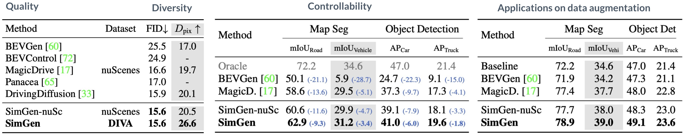
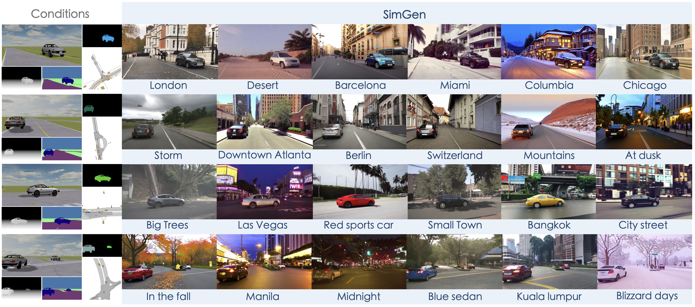

<!---
<div class="img-container" style="width: 100%; margin: 0 auto;">
    
</div>
slides_link: https://docs.google.com/presentation/d/1X1nB9umPlWtNfuUjZObO6UNyyBUbgHogVJA4bCaMiKQ/edit?usp=sharing
--->


<style>
.video-container {
  position: relative;
  max-width: 80%; /* Adjust this value to control the maximum width of the video container */
  margin: -30px auto 0; /* Optional: center the video container horizontally */
}

.video-container video {
  display: block;
  margin: 0 auto;
  max-width: 100%;
  max-height: 100%;
}
</style>

<div class="video-container">
  <video loop autoplay muted playsinline src="../assets/img/simgen/SimGenWide.mp4"></video>
</div>


<!---
<div class="embed-responsive embed-responsive-21by9">
    <video width="100%" max-width="800px" loop autoplay muted playsinline src="../assets/img/simgen/SimGenWide.mp4">
    </video>
</div>
--->


<!--research-section-splitter-->


## TL; DR

:fire: **SimGen** is the first simulator-conditioned generative model for controllable driving scene generation with `appearance` and `layout` diversity.

:star2: **SimGen** addresses simulation to reality `(Sim2Real)` gaps via cascade diffusion paradigm, and follows layout guidance from simulators and cues of the rich text prompts to realistic driving scenarios.

:bar_chart: **DIVA dataset** comprises 147.5 hours of `web videos` and `synthesized data` for diverse scene generation and advancing Sim2Real research.


<!--research-section-splitter-->


## SimGen Arcitecture


<div class="img-container" style="width: 100%; margin: 0 auto;">
    
</div>

SimGen processes text and scene record as inputs. The text is feature-encoded and utilized in the subsequent modules, whereas the scene record undergoes a simulator rendering into simulated depth and segmentation (SimCond) and extra conditions (ExtraCond).
SimCond, coupled with the text features, is fed into the CondDiff module that converts SimCond into RealCond, representing real depth and segmentation. Eventually, the text features, SimCond, and ExtraCond are inputted into the ImgDiff module, where an Adapter merges multi-source conditions into a unified control condition and generates driving scene images.

<!--research-section-splitter-->

## DIVA Dataset

<div class="img-container" style="width: 100%; margin: 0 auto;">
    
</div>


**Data Collection.** DIVA-Real (left) comprises driving videos collected from YouTube. We apply a Vision Language Model to filter out noisy images via a checklist and utilize off-the-shelf models to annotate text, depth, and semantic labels. Meanwhile, DIVA-Sim (right) employs scene records and control policies in a simulator to create map elements and objects.
It can generate digital twins of real-world data and safety-critical scenes. 
Then various kinds of sensors placed in the simulation produce multimodal images.


<div class="img-container" style="width: 100%; margin: 0 auto;">
    
</div>

**DIVA-Real.** 
It collects driving videos from YouTube, covering a worldwide range of geography, weather, scenes, and traffic elements and preserving the appearance diversity of a wide range of traffic participants. Here we provide a sample of 🔗 [YouTube video list](https://docs.google.com/spreadsheets/d/1lKfd0iARpJl-5K37XSXRwiZIWi1LrTvL/edit?usp=sharing&ouid=102597623866661259117&rtpof=true&sd=true) we used.
For privacy considerations, we are temporarily keeping the complete data labels private.

<div class="img-container" style="width: 100%; margin: 0 auto;">
    
</div>


**DIVA-Sim.** 
The Sim2Real data is induced from the same real-world scenarios, in which we can obtain real-world map topology, layout, and raw sensor data.
It also includes hazardous driving behaviors through interactions introduced by adversarial traffic generation.
The digital twins (on nuScenes dataset) and safety-critical scenarios (on Waymo Open dataset) can be obtained through this :link:[data link](https://drive.google.com/drive/folders/1K7NrujRlfyI6VrH6Kd9kTHCeKnpl4bab?usp=sharing). 


<!--research-section-splitter-->


## Experiment


<div class="img-container">
    
</div>

SimGen improves over counterparts in terms of image quality, diversity, and controllability of scene generation.


<div class="img-container">
    
</div>

We show the generation results of SimGen (blue boxes) under simulator conditions. 
Compared to models confined to limited datasets, SimGen exhibits a stronger ability to generate more realistic and diverse driving scenarios.


<div class="img-container">
    
</div>

SimGen can also recreate image sequences of safety-critical scenes where risky driving behaviors like sudden braking and merging happen. And the effectiveness of each modality in simulator conditions is exhibited, where instance map, rendered RGB, and top-down view enable the model to better handle object boundaries, orientation angles, and occlusions.


<div class="img-container">
    
</div>

We further explore applying SimGen to the closed-loop evaluation. The evaluation focuses on two driving behaviors, namely IDM (gray boxes) and manual control (blue boxes) in different scenarios. IDM could lead to risks like sudden braking or collision in these cases. Conversely, manual control promotes safety by maintaining distance and slowing down. 


<!--research-section-splitter-->


## Acknowledgement

The project is supported by the NSF Grants CCRI-2235012 and RI-2339769, and Sony Focused Research Award.


## License and Citation

All assets and code in this repository are under the [Apache 2.0 license](./LICENSE) unless specified otherwise. The annotation data is under [CC BY-NC-SA 4.0](https://creativecommons.org/licenses/by-nc-sa/4.0/). Other datasets (including nuScenes, Waymo, and MetaDrive) inherit their own distribution licenses. Please consider citing our paper and project if they help your research.


```BibTeX
@article{zhou2024simgen,
  title={SimGen: Simulator-conditioned Driving Scene Generation},
  author={Zhou, Yunsong and Simon, Michael and Peng, Zhenghao and Mo, Sicheng and Zhu, Hongzi and Guo, Minyi and Zhou, Bolei},
  journal={arXiv preprint arXiv:2406.09386},
  year={2024}
}
```


<!--research-section-splitter-->

## Prior Works


**[FreeControl (CVPR 2024)](https://genforce.github.io/freecontrol/)**:
Training-Free spatial control of any text-to-image diffusion model with any condition.

**[ScenarioNet (NeurIPS 2023)](https://metadriverse.github.io/scenarionet/)**:
An open-source platform for large-scale traffic scenario simulation and modeling.


**[CAT (NeurIPS 2023)](https://metadriverse.github.io/cat/)**:
Closed-loop adversarial training for safe end-to-end driving.


