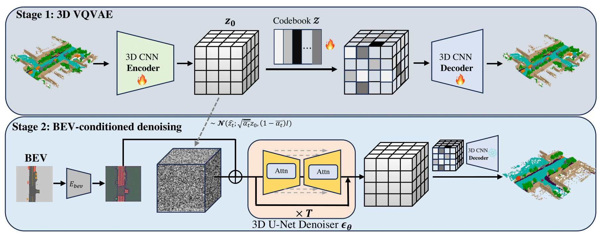

## Overview
<div class="teaser">
    <video style="display:block; width:100%; height:auto;" controls autoplay loop>
                    <source src="https://github.com/Andy-zd/material/releases/download/videos/waymo.mp4" type="video/mp4">
    </video>
    <div class="teaser-caption">
        Fig. 1: Diverse individual scenes generated by UrbanDiffusion.
    </div>
</div>

This work presents UrbanDiffusion, a novel 3D diffusion model for generating large-scale urban scenes from Bird's-Eye View (BEV) maps. The model innovatively incorporates both the geometry and semantics of urban structures and objects, extending beyond mere visual representation. It learns the data distribution of scene-level structures within a latent space, thereby facilitating the generation of diverse urban scenes of any scale. Trained on a real-world driving dataset, this model is capable of generating scenes from both held-out BEV maps and synthesized maps from a driving simulator. Furthermore, this work illustrates its applicability in scene image synthesis using a pretrained image generator. 

<!--research-section-splitter-->

## Method

<div class="teaser">
    
    <div class="teaser-caption">
        Fig. 2: Framework of UrbanDiffusion.
    </div>
</div>
In order to train the diffusion model in a fast and memory efficient way, we choose to follow the latent diffusion model to learn the latent distribution of the 3D data. We thus first embed the 3D semantic data in the space with a lower dimension and then conduct a classifier-free guidance for the diffusion process in this latent feature space. Given a BEV layout, the trained model can generate diverse and realistic samples
that contain the scene geometry and semantic information through sampling process:
<div align="center">
$$
\hat{\epsilon}_\theta ( z_t |c_{bev})=  \epsilon_{\theta}(z_t|\phi) + w \cdot (\epsilon_{\theta}(z_t|c_{bev})-\epsilon_{\theta}(z_t|\phi)).
$$
</div>


<!--research-section-splitter-->


## Scene Generation
**Condition on single frame BEV map**
<br>
We demonstare the generated samples on BEV maps from different datasets, including nuScenes Validation set, Waymo Motion Dataset, nuPlan Dataset and Metadrive Procedural Generation Map.

<strong>nuScenes Validation set</strong>
<video style="display:block; width:100%; height:auto;" controls autoplay loop>
    <source src="https://github.com/Andy-zd/material/releases/download/videos/nusc_val.mp4" type="video/mp4">
</video>

<strong>nuPlan Dataset</strong>
<video style="display:block; width:100%; height:auto;" controls autoplay loop>
    <source src="https://github.com/Andy-zd/material/releases/download/videos/nuplan.mp4" type="video/mp4">
</video>

<strong>Metadrive Procedural Generation Map</strong>
<video style="display:block; width:100%; height:auto;" controls autoplay loop>
    <source src="https://github.com/Andy-zd/material/releases/download/videos/pgmap.mp4" type="video/mp4">
</video>

**Large-scale Scene Generation**

<video style="display:block; width:100%; height:auto;" controls autoplay loop>
  <source src="https://github.com/Andy-zd/material/releases/download/videos/large_scene_generation.mp4" type="video/mp4">
</video>
<br>

<!--research-section-splitter-->


## Scene Synthesis
**Synthesis on scenes from different dataset**
<br>
We perform scene synthesis on different scenes which are sampled from diverse BEV maps:

<video style="display:block; width:100%; height:auto;" controls autoplay loop>
  <source src="https://github.com/Andy-zd/material/releases/download/videos/short_scene_synthesis.mp4" type="video/mp4">
</video>
<br>

<!--research-section-splitter-->


## Reference

```plain
@article{urbandiff,
    title={Urban Scene Diffusion through Semantic Occupancy Map},
    author={Junge Zhang and Qihang Zhang and Li Zhang and Ramana Rao Kompella and Gaowen Liu and Jiachen Li and Bolei Zhou},
    journal={arXiv preprint arXiv:2403.11697},
    year={2024}
}
```

<br>
<!--research-section-splitter-->

## Acknowledgement

This work was supported by the Cisco Faculty Award.

