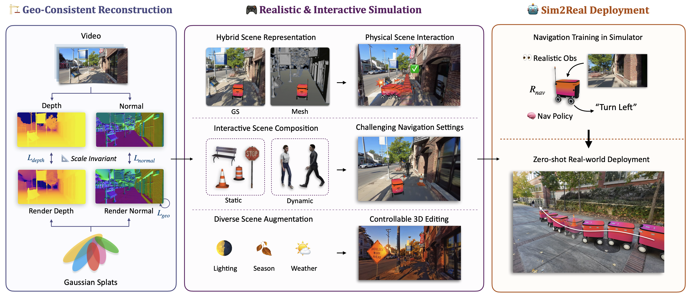
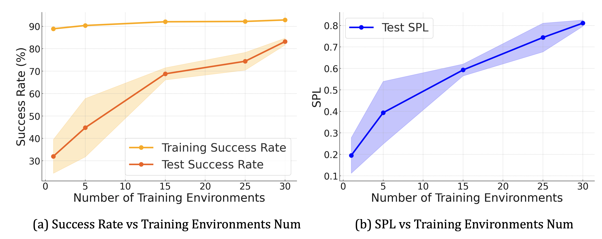

<!---

    

slides_link: https://docs.google.com/presentation/d/1X1nB9umPlWtNfuUjZObO6UNyyBUbgHogVJA4bCaMiKQ/edit?usp=sharing
--->

  <video loop controls autoplay muted playsinline src="../assets/img/vid2sim/Vid2Sim_long.mp4"></video>

<!---

    <video width="100%" max-width="800px" loop autoplay muted playsinline src="../assets/img/simgen/SimGenWide.mp4">
    </video>

--->

<!--research-section-splitter-->

## TL; DR

:selfie: **Vid2Sim** can convert real-world monocular videos into `realistic` and `interactive` digital-twin environments in simulation for urban navigation training.

:robot: **Vid2Sim** enables reinforcement learning agents to learn navigation policies in diverse realistic simulation scenarios, where the learned policies can be directly deployed on real-world robots with minimal `sim-to-real gap`.  

## Vid2Sim Architecture

    

Vid2Sim framework consists of three key stages: (1) **Geometry-consistent reconstruction** for high-quality real-to-sim environment creation, (2) building a **realistic and interactive simulation** with hybrid scene representation and diverse obstacle and scene augmentation for urban navigation training, and (3) zero-shot **sim-to-real deployment** in the real world to verify our pipeline's effectiveness.

## Interactive Scene Composition

    

Vid2Sim facilitates augmented real-to-sim environment creation through interactive scene composition, including varied **static obstacles** and other **dynamic agents**. This approach enables the generation of **diverse**, **controllable** and **safty critical** corner cases for safe urban navigation training.

## Real2Sim Navigation Training
We train and test our agents in diverse realistic real2sim environments with augmented static obstacles and dynamic agents. (Bottom-right is the agent's view)

    

        <video style="display:block; width:100%; height:auto;" muted controls playsinline>
        <source src="../assets/img/vid2sim/simulation/sim_nav1.mp4" type="video/mp4">
        </video>
    

    

        <video style="display:block; width:100%; height:auto;" muted controls playsinline>
        <source src="../assets/img/vid2sim/simulation/sim_nav2.mp4" type="video/mp4">
        </video>
    

 

## Zero-shot Sim2Real Deployment
After training in real2sim environments, we deploy our agents to the real world in a zero-shot manner. This demonstrates the effectiveness of our Vid2Sim pipeline in bridging the sim-to-real gap.  

* *Note: Our policies only take `RGB` images as visual observation and deployed in the real world without any fine-tuning*

    

        <figure>
            <video style="display:block; width:100%; height:auto;" muted controls playsinline>
                <source src="../assets/img/vid2sim/realworld/realworld_nav1.mp4" type="video/mp4">
            </video>
            <figcaption style="text-align:center; margin-top:8px; font-size:14px;">
                Static & Dynamic Obstacles Avoidance
            </figcaption>
        </figure>
    

    

        <figure>
            <video style="display:block; width:100%; height:auto;" muted controls playsinline>
                <source src="../assets/img/vid2sim/realworld/realworld_nav2.mp4" type="video/mp4">
            </video>
            <figcaption style="text-align:center; margin-top:8px; font-size:14px;">
                Sudden Pedestrian Cut-in
            </figcaption>
        </figure>
    

## Real2Sim Digital-Twin 
We show our Vid2Sim pipeline could generate realistic digital-twin environments for realworld scenes. The digital-twin environment is controllable as well as interactive and can be used for both policy training and evaluation navigation policies. 

    

## Diverse Environment Augmentation
Vid2Sim can further support controllable scene editing and advanced weather simulation through 3D scene editing and particle system simulation. This enables more robust and generalizable policy training under different lighting and weather conditions.

<h4 style="text-align: center; margin-bottom: 0px">Global 3D Scene Editing</h4>

  <video loop autoplay muted playsinline src="../assets/img/vid2sim/editing/augment.m4v"></video>

<h4 style="text-align: center; margin-bottom: 10px">Weather Simulation</h4>

    

        <figure>
            <video style="display:block; width:100%; height:auto;" muted controls playsinline>
                <source src="../assets/img/vid2sim/editing/rain.mp4" type="video/mp4">
            </video>
            <figcaption style="text-align:center; margin-top:8px; font-size:14px;">
                Rain Simulation
            </figcaption>
        </figure>
    

    

        <figure>
            <video style="display:block; width:100%; height:auto;" muted controls playsinline>
                <source src="../assets/img/vid2sim/editing/fog.mp4" type="video/mp4">
            </video>
            <figcaption style="text-align:center; margin-top:8px; font-size:14px;">
                Fog Simulation
            </figcaption>
        </figure>
    

## Scalable Real2Sim Environments

We curate a dataset of 30 diverse real-to-sim (real2sim) environments from web sourced videos for urban navigation training. We further evaluate the generalizability improvement of our agents as the number of the training environment increase.

<h4 style="text-align: center; margin-bottom: 15px">Environments Gallery</h4>

  <video loop autoplay muted playsinline src="../assets/img/vid2sim/gallery.mp4"></video>

 

<h4 style="text-align: center; margin-bottom: 15px">Generalizability Results</h4>

    

This table compares (a) the success rate (SR) and (b) success rate weighted by path length (SPL) across varying numbers of training environments. Increasing the number of training environments leads to a higher test success rate and SPL, which indicates improved agents generalizability.

 

<h3 style="text-align: center">Reference</h3>

<pre><code class="language-plain">@article{xie2024vid2sim,
  title={Vid2Sim: Realistic and Interactive Simulation from Video for Urban Navigation},
  author={Ziyang Xie and Zhizheng Liu and Zhenghao Peng and Wayne Wu and Bolei Zhou},
  journal={Preprint},
  year={2024}
}
</code></pre>