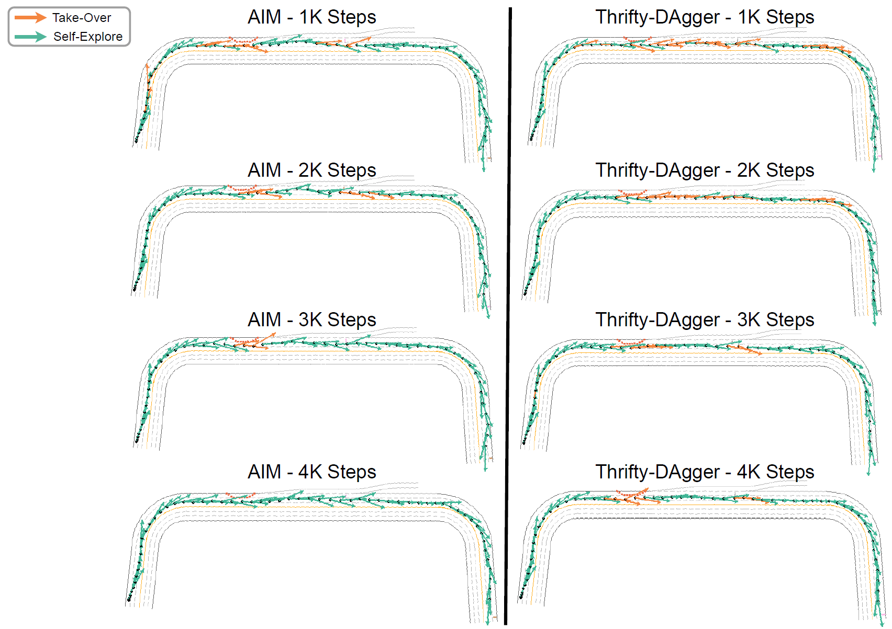

<div  style="text-align: center;">
    <video width="100%" max-width="800px" loop autoplay muted playsinline src="../assets/img/aim/AIM-Train.mp4" style="width: 70%; max-width: 800px; height: auto; display: inline-block;">
    </video>
</div>

<!-- <div style="text-align: center;">
    <video loop autoplay muted playsinline src="../assets/img/aim/AIM-Train.mp4" style="width: 70%; max-width: 800px; height: auto; display: inline-block;">
    </video>
</div> -->

<!--research-section-splitter-->

## Summary

**Adaptive Intervention Mechanism (AIM)** is a robot-gated Interactive Imitation Learning (IIL) algorithm.
* AIM learns an adaptive intervention criterion via a proxy Q-function that mimics human decisions.
* Human does not need to continuously monitor until AIM requests human help.

In experiments on continuous (MetaDrive) and discrete (MiniGrid) tasks, AIM:

* Improves learning efficiency and cuts expert takeover cost by 40%.  
* Requires the expert only demonstrate 1-2 trajectories before switching to robot-gated mode.  
* Focuses on safety-critical states to collect fewer, higher-quality demonstrations.  
* Matches the human-gated methods' performance with AIM-gated interventions.

<!--research-section-splitter-->

## Adaptive Intervention Mechanism

We apply a proxy Q function to approximate the human's intervention behavior. The core of AIM is the learned proxy Q-function that predicts when a human would step in: it’s trained to output +1 whenever the agent’s action deviates significantly from demonstrated expert behavior (signaling that intervention is needed) and –1 when the agent matches the expert’s action (no intervention). By labeling agent-sampled actions with +1 and human demonstrations with –1, AIM learns to mimic the human gating mechanism without explicit rules. This lets the system automatically decide when to request help as the agent’s policy improves.

**AIM Loss Function**  
<div class="img-container" style="width: 60%;">
    
</div>

**TD Loss Function**  
$$
J^{\mathrm{TD}}(\theta) = \mathbb{E}_{(s,a,s')}\Bigl\lvert
Q_\theta(s,a) - \gamma \max_{a'} Q_\theta(s',a')\Bigr\rvert^2
$$

**Combined Objective**  
$$
J(\theta) = J^{\mathrm{AIM}}(\theta) + J^{\mathrm{TD}}(\theta)
$$

**Intervention Rule**  
Request human help whenever  
$$
Q_\theta(s,a_n) > \text{the }(1-\delta)\text{-quantile of }Q_\theta(s,a_n).
$$

We select $$\delta=0.05$$ to balance the training safety and expert take-over cost.

<div  style="text-align: center;">
    <video width="100%" max-width="800px" loop autoplay muted playsinline src="../assets/img/aim/delta.mp4" style="width: 100%; max-width: 800px; height: auto; display: inline-block;">
    </video>
</div>

<!--research-section-splitter-->

## Experiment
Compared to the Interactive Imitation Learning baselines, our method AIM reduces expert-involved steps.

<div class="img-container">
    
</div>
<br/>

Our method AIM requests fewer expert help to achieve near-optimal performance compared with robot-gated IIL baselines in MetaDrive. Compared with human-gated ones, AIM reduces expert monitoring effort and cognitive cost.

<div class="img-container" style="width: 80%; margin: 0 auto;">
    
</div>

<br/>

A case study in a toy MetaDrive environment shows that our method AIM reduces expert queries as the agent becomes more proficient, while the uncertainty-based method Thrifty-DAgger continues to request expert assistance frequently on the straight road.

<div class="img-container" style="width: 80%; margin: 0 auto;">
    
</div>
<!--research-section-splitter-->


## Reference

**Adaptive Intervention Mechanism (ICML 2025)**:
```plain
@article{cai2025robot,
  title={Robot-Gated Interactive Imitation Learning with Adaptive Intervention Mechanism},
  author={Cai, Haoyuan and Peng, Zhenghao and Zhou, Bolei},
  journal={International Conference on Machine Learning},
  year={2025}
}   
```

<br>

**Acknowledgement**: The project was supported by NSF grants CCF-2344955 and IIS-2339769. ZP is supported by the Amazon Fellowship via UCLA Science Hub.