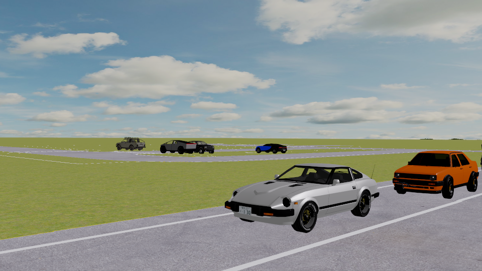
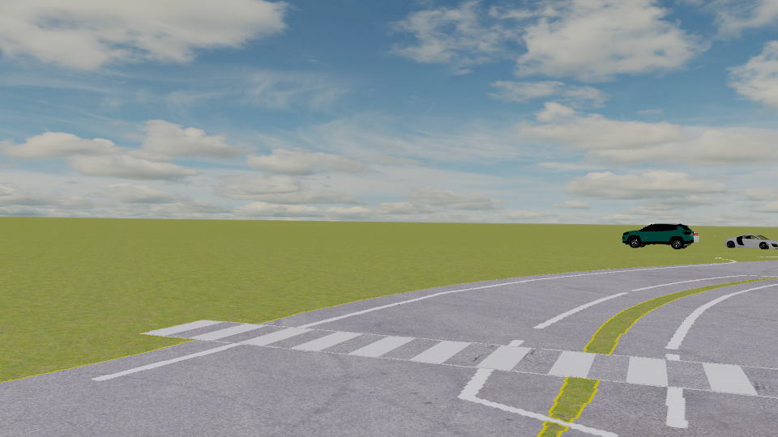

<header class="post-header center-text">
    <h1 class="post-title">MetaVQA Examples</h1>
</header>

  
Here, we list some examples for each question type.

  
We will release the full dataset later, stay tuned!

    <!-- Question Type -->
      

        
Static|Color Identification

        <!-- <h2 style="margin-bottom: 15px;">Question Type: Static|Color Identification</h2> -->
    

    

        <!-- First Row -->
        

            Left Front
            
        

        

            Front
            
        

        

            Right Front
            
        

        <!-- Second Row -->
        

            Left Back
            
        

        

            Back
            
        

        

            Right Back
            
        

    

    

        
<strong>Question:</strong> Describe the colors of trucks.

        
<strong>Answers:</strong> White

    

    <!-- Question Type -->
      

        
Static|Count More Binary

        <!-- <h2 style="margin-bottom: 15px;">Question Type: Static|Color Identification</h2> -->
    

    

        <!-- First Row -->
        

            Left Front
            
        

        

            Front
            
        

        

            Right Front
            
        

        <!-- Second Row -->
        

            Left Back
            
        

        

            Back
            
        

        

            Right Back
            
        

    

    

        
<strong>Question:</strong> Are black vehicles outnumbered by blue sports cars?

        
<strong>Answers:</strong> False

    

    <!-- Question Type -->
      

        
Static|Count Equal Binary

        <!-- <h2 style="margin-bottom: 15px;">Question Type: Static|Color Identification</h2> -->
    

    

        <!-- First Row -->
        

            Left Front
            
        

        

            Front
            
        

        

            Right Front
            
        

        <!-- Second Row -->
        

            Left Back
            
        

        

            Back
            
        

        

            Right Back
            
        

    

    

        
<strong>Question:</strong> Are the quantities of yellow sports cars and pickups equal?. Answer True or False.

        
<strong>Answers:</strong> False

    

    <!-- Question Type -->
      

        
Static|Counting

        <!-- <h2 style="margin-bottom: 15px;">Question Type: Static|Color Identification</h2> -->
    

    

        <!-- First Row -->
        

            Left Front
            
        

        

            Front
            
        

        

            Right Front
            
        

        <!-- Second Row -->
        

            Left Back
            
        

        

            Back
            
        

        

            Right Back
            
        

    

    

        
<strong>Question:</strong> Record the quantity of orange sedans.

        
<strong>Answers:</strong> 1

    

    <!-- Question Type -->
      

        
Static|Type Identification

        <!-- <h2 style="margin-bottom: 15px;">Question Type: Static|Color Identification</h2> -->
    

    

        <!-- First Row -->
        

            Left Front
            
        

        

            Front
            
        

        

            Right Front
            
        

        <!-- Second Row -->
        

            Left Back
            
        

        

            Back
            
        

        

            Right Back
            
        

    

    

        
<strong>Question:</strong> List the types of red objects.

        
<strong>Answers:</strong> Sedan

    

    <!-- Question Type -->
      

        
Static|Type Identification Unique

        <!-- <h2 style="margin-bottom: 15px;">Question Type: Static|Color Identification</h2> -->
    

    

        <!-- First Row -->
        

            Left Front
            
        

        

            Front
            
        

        

            Right Front
            
        

        <!-- Second Row -->
        

            Left Back
            
        

        

            Back
            
        

        

            Right Back
            
        

    

    

        
<strong>Question:</strong> Name the type of the red object. I'm referring to the one that is located at [-36, 2].

        
<strong>Answers:</strong> Sports car

    

    <!-- Question Type -->
      

        
Static|Localization

        <!-- <h2 style="margin-bottom: 15px;">Question Type: Static|Color Identification</h2> -->
    

    

        <!-- First Row -->
        

            Left Front
            
        

        

            Front
            
        

        

            Right Front
            
        

        <!-- Second Row -->
        

            Left Back
            
        

        

            Back
            
        

        

            Right Back
            
        

    

    

        
<strong>Question:</strong> Pinpoint the whereabouts of all vehicles directly behind us. Give me the centers expressed in our coordinates.

        
<strong>Answers:</strong> [-30.6, 0.8]

    

